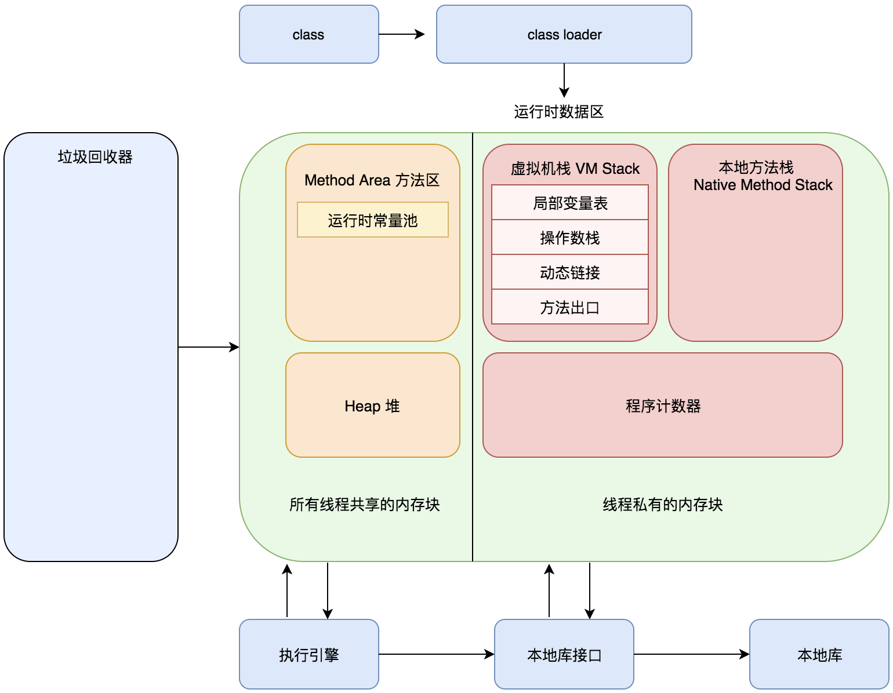
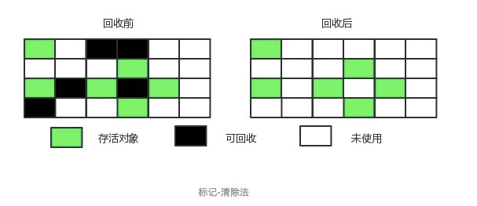
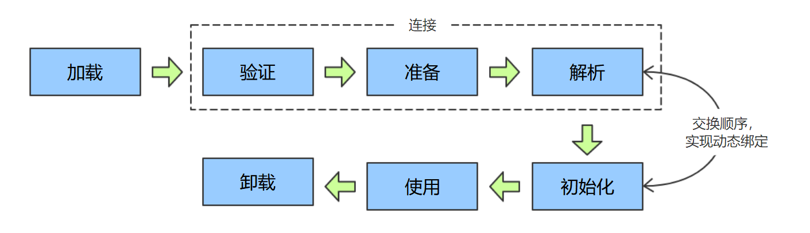

## JVM

### JVM体系结构

### 运行时数据区

##### 组成

方法区：线程共享，用于存储虚拟机加载的类信息，常量（final），静态变量，即时编译器（JIT）编译的代码数据。

堆：线程共享，程序运行时创建的对象实例，垃圾回收的主要区域。

虚拟机栈：线程不共享，虚拟机为每个方法创建一个栈帧，包括局部变量表、操作数栈、动态链接、方法出口等，当方法执行完，栈帧出栈。其中，局部变量表包含了基本数据类型和对象引用。

本地方法栈：线程不共享，类似虚拟机栈，虚拟机栈是为了Java方法执行而创建，本地方法栈是为了本地方法执行而创建。

程序计数器：线程不共享，用于记录当前线程执行的字节码指令位置，由于虚拟机的多线程是通过切换cpu的执行权限实现，不同线程的执行位置要记录下来。

##### Java8元空间:

1. 移除了永久代（PermGen），替换为元空间（Metaspace）；

2. 永久代中的 class metadata 转移到了 native memory（本地内存，而不是虚拟机）；

3. 永久代中的 interned Strings 和 class static variables 转移到了 Java heap；

4. 永久代参数 （PermSize MaxPermSize） -> 元空间参数（MetaspaceSize MaxMetaspaceSize）

所以使用jdk8造成的oom都表现为java.lang.OutOfMemoryError: Java heap space

再来说说为什么要将永久代 (PermGen) 或者说方法区替换为元空间 (MetaSpace) 。

第一，永久代放在 Java 虚拟机中，就会受到 Java 虚拟机内存大小的限制，而元空间使用的是本地内存，也就脱离了 Java 虚拟机内存的限制。

第二，JDK 8 的时候，在 HotSpot 中融合了 JRockit 虚拟机，而 JRockit 中并没有永久代的概念，因此新的 HotSpot 就没有必要再开辟一块空间来作为永久代了。

### 垃圾回收

#### 判断哪些对象可被回收

##### 引用计数法

描述：给每一个对象设置一个引用计数器，每当有新的引用指向它时，引用计数器+1，反之-1，当引用计数器为0时，说明没有引用指向它，即可被回收。

缺点：不能解决循环引用问题。

##### 可达性分析算法

描述：通过GC Roots作为起始节点进行搜索，能够达到的对象都是存活的。

能被GC Roots搜索到的范围：

虚拟机栈引用的对象，方法区中静态属性引用的对象，方法区中常量引用的对象，本地方法栈中JNI引用的对象。

#### 垃圾收集算法

新生代：复制回收

老年代：标记-清除、标记-整理

##### 标记-清除算法

缺点：效率不高；会产生大量内存碎片，不利于后续大对象的空间分配。

##### 标记-整理算法

##### 复制回收

同标记整理算法相同，将内存分为两个区域，每次整理的时候将存活的对象移动至另一侧。

缺点同样明显，内存的使用效率不高。

（Eden、from Survivor、to Survivor）

### 垃圾收集器*

### 内存分配策略

1、对象优先分配到Eden

新创建的对象被分配到新生代的Eden区域，每次Minor GC后，将存活的对象移动至to Survivor区域，并且将from Survivor中的存活对象也移动至to Survivor区域，得到的结果是清空Eden和from Survivor，互换from Survivor和to Survivor。当to Survivor中的对象达到一定年龄后，移至老年代。

当Eden区域的内存不够分配下一个对象时，触发MinorGC

2、 大对象直接进入老年代

典型的大对象是数组（很长的字符串？）

3、长期存活的对象进入老年代

4、动态对象年龄判断

当Survivor中相同年龄对象大小总和大于Survivor空间的一半时，则该年龄及以上的对象移动至老年代。

5、空间分配担保

进行MinorGC之前，先查看老年代的最大连续可用空间是否大于新生代所有对象的总空间，如果不大于，查看虚拟机参数设置是否允许担保失败，如果允许，则尝试进行MinorGC，否则触发FullGC。

##### FullGC触发条件

- 调用System.gc()，这只是建议虚拟机执行FullGC，并不一定执行

- 老年代空间不足

- 空间分配担保失败

- JDK1.7以前永久代空间不足。JDK1.7之前方法区是用永久代实现的，当类数据、常量等过多时，在未配置CMSGC时，会触发FullGC，如果仍然解决不了永久代空间不足，抛出OOM。

### 类加载机制

加载源：

- 文件

- 网络

- 数据库

- 计算生成（动态代理）

虚拟机把类数据从Class文件加载的内存，形成一个可以被虚拟机使用的Java类型。

##### 类的生命周期

其中解析过程可能在初始化之前，这是为了支持动态绑定。

#### 类加载过程

##### 加载

- 通过一个类的全限定类名获取定义此类的二进制流。

- 通过这个二进制流生成方法区中运行时使用的存储结构

- 在内存中生成一个Class对象，作为访问这个类的类属性的入口

**加载源**

##### 验证

确保class文件流中的数据符合当前虚拟机的要求，并且不会危害虚拟机自身安全。

#####  准备

为类变量赋默认值（int 0，boolean false等），使用的是方法区的内存。

实例变量的赋值使用的是堆空间，这个过程不属于类加载过程。

##### 解析

将符号引用替换为直接引用

**什么是符号引用和直接引用？***

##### 初始化

为类变量赋初始值，执行static语句块

#### 类初始化时机

##### 主动引用

1. 遇到new、getstatic、putstatic、invokestatic四条字节码指令时，如果没有进行过该类的初始化，会先对该类进行初始化，对应的操作通常是：new实例对象，读取或操作静态字段（被final修饰的除外，属于常量，在编译阶段就进入了方法区），调用静态方法。

2. 对类进行反射调用，如果没有初始化，会先触发其初始化

3. 初始化一个类，如果其父类没有被初始化，会先触发其父类的初始化

4. 虚拟机启动时，初始化主类

5. 当使用 JDK 1.7 的动态语言支持时，如果一个 java.lang.invoke.MethodHandle 实例最后的解析结果为 REF_getStatic, REF_putStatic, REF_invokeStatic 的方法句柄，并且这个方法句柄所对应的类没有进行过初始化，则需要先触发其初始化

##### 被动引用

除以上情况，都属于被动引用，不会触发类的初始化。

1. 子类引用父类静态字段，不会导致子类初始化。
2. 通过数组定义，不会触发类型的初始化，会触发数组类的初始化。数组类由虚拟机自动生成。
3. 常量在编译阶段存入调用类的常量池中，不会触发定义常量的类的初始化。

### 类加载器

##### 类的相等

被不同的类加载器加载的同一字节码文件生成的类不相等。

包含Class对象的equals()、isAssignableFrom() 方法、isInstance() 方法的返回结果为 true，instanceof 。

##### 分类

Bootstrap classloader

Extension ClassLoader 加载jre/lib/ext下的类库与java.ext.dir指定目录的类库

Application ClassLoader 加载classpath下指定的类库

##### 双亲委派机制

优先使用父类加载器（bootstrap优先级最高）

##### 为什么要使用双亲委派机制

JVM认定两个对象同属一个类，必须满足两个条件：同名的类实例化；对应的类加载器必须是同一个。为了系统的安全，类似java.lang.Object这种核心类，由bootstrap类加载器完成加载，保证了Java应用使用的是同一个版本的Java核心库的类，是互相兼容的。

### Java虚拟机工具

jps、jstat、jstack、jinfo、jmap

jconsole

https://juejin.cn/post/6950927106565996551