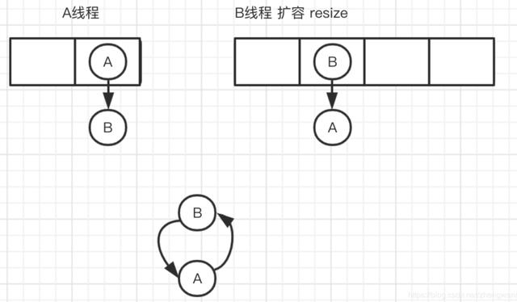

# Collection

### 体系结构


### HashMap的工作原理

HashMap内部是通过一个数组实现的，数组类型为Node，包含key，value，next指针。

```java
transient Node<K,V>[] table;
```

默认容量16，加载因子0.75，扩容一倍

```java
    /**
     * The default initial capacity - MUST be a power of two.
     */
    static final int DEFAULT_INITIAL_CAPACITY = 1 << 4; // aka 16

    /**
     * The maximum capacity, used if a higher value is implicitly specified
     * by either of the constructors with arguments.
     * MUST be a power of two <= 1<<30.
     */
    static final int MAXIMUM_CAPACITY = 1 << 30;

    /**
     * The load factor used when none specified in constructor.
     */
    static final float DEFAULT_LOAD_FACTOR = 0.75f;
```

Entry:

```java
static class Node<K,V> implements Map.Entry<K,V> {
        final int hash;
        final K key;
        V value;
        Node<K,V> next;
    }
```

put时，根据key值进行hash运算，得到hashcode后与数组长度进行取模运算，得到将要放置的数组位置。

- size最开始是0，当放入第一个元素时调用resize扩容

```java
if ((tab = table) == null || (n = tab.length) == 0)
            n = (tab = resize()).length;
```

get时，根据key计算hash，计算出数组下标，再遍历链表比较完整的hashcode。

##### hash方法

hashcode（int）前后16位做异或操作

```java
    static final int hash(Object key) {
        int h;
        return (key == null) ? 0 : (h = key.hashCode()) ^ (h >>> 16);
    }
```

##### 计算下标

(n - 1) & hash

```java
final V putVal(int hash, K key, V value, boolean onlyIfAbsent,
                   boolean evict) {
        Node<K,V>[] tab; Node<K,V> p; int n, i;
        if ((tab = table) == null || (n = tab.length) == 0)
            n = (tab = resize()).length;
        if ((p = tab[i = (n - 1) & hash]) == null)//!!!!!!!!
            tab[i] = newNode(hash, key, value, null);
        else {
//...
```

put后

如果size超过阈值（容量*加载因子），扩容后重排（resize)

对于单个桶中元素过多时，超过一定数量（default 8，可指定）会变成红黑树，查询效率O(log n)，小于6恢复成链表。hashcode碰撞次数的泊松分布有关，主要是为了寻找一种时间和空间的平衡。在负载因子0.75（HashMap默认）的情况下，单个hash槽内元素个数为8的概率小于百万分之一。

```java
    /**
     * The bin count threshold for using a tree rather than list for a
     * bin.  Bins are converted to trees when adding an element to a
     * bin with at least this many nodes. The value must be greater
     * than 2 and should be at least 8 to mesh with assumptions in
     * tree removal about conversion back to plain bins upon
     * shrinkage.
     */
    static final int TREEIFY_THRESHOLD = 8;

    /**
     * The bin count threshold for untreeifying a (split) bin during a
     * resize operation. Should be less than TREEIFY_THRESHOLD, and at
     * most 6 to mesh with shrinkage detection under removal.
     */
    static final int UNTREEIFY_THRESHOLD = 6;
```

```java
private final void treeifyBin(Node<K,V>[] tab, int index)
```

##### 1.8优化

- 数组+链表改成了数组+链表或红黑树；
- 链表的插入方式从头插法改成了尾插法，简单说就是插入时，如果数组位置上已经有元素，1.7将新元素放到数组中，原始节点作为新节点的后继节点，1.8遍历链表，将元素放置到链表的最后；
- 扩容的时候1.7需要对原数组中的元素进行重新hash定位在新数组的位置，1.8采用更简单的判断逻辑，位置不变或索引+旧容量大小；
- 在插入时，1.7先判断是否需要扩容，再插入，1.8先进行插入，插入完成再判断是否需要扩容；

##### 线程不安全

1.7 扩容方法transfer：

多线程下冲突链表死循环：当多个线程进行插入操作时刚好发生扩容操作，线程一执行时被挂起，线程二执行完扩容，线程一执行完，两线程对于链表进行的重排序会导致循环引用。当再次调用到其中的get()方法时，会进入死循环。



数据丢失。

1.8 扩容方法resize：尾插法（没有了环链的问题），但有数据覆盖。

HashTable是线程安全的，但每次操作都会锁住整个表，效率低下。

#####  HashMap为什么用红黑树而不是AVL平衡树

红黑树牺牲了写查找性能，插入删除操作性能高一些。

AVL有严格的平衡策略，适用于查找密集型的任务，而为了维护平衡，增加和删除操作相对于红黑树就要麻烦一些，需要更高的旋转次数。

### ArrayList

扩容：

```java
    /**
     * Default initial capacity.
     */
    private static final int DEFAULT_CAPACITY = 10;
```

full扩容1.5倍

```java
        // overflow-conscious code
        if (minCapacity - elementData.length > 0)
            grow(minCapacity);	

		/**
     * Increases the capacity to ensure that it can hold at least the
     * number of elements specified by the minimum capacity argument.
     *
     * @param minCapacity the desired minimum capacity
     */
    private void grow(int minCapacity) {
        // overflow-conscious code
        int oldCapacity = elementData.length;
        int newCapacity = oldCapacity + (oldCapacity >> 1);
        if (newCapacity - minCapacity < 0)
            newCapacity = minCapacity;
        if (newCapacity - MAX_ARRAY_SIZE > 0)
            newCapacity = hugeCapacity(minCapacity);
        // minCapacity is usually close to size, so this is a win:
        elementData = Arrays.copyOf(elementData, newCapacity);
    }
```

### ConcurrentHashMap

1.7前，ConcurrentHashMap 采用了分段锁技术，其中 Segment 继承于 ReentrantLock。不会像 HashTable 那样不管是 put 还是 get 操作都需要做同步处理，理论上 ConcurrentHashMap 支持 CurrencyLevel (Segment 数组数量)的线程并发。每当一个线程占用锁访问一个 Segment 时，不会影响到其他的 Segment。而对于size()等需要跨段的方法，仍需锁住整个表。

get则不会加锁，因为Entry的value是volatile，不会synchronize读操作也能保证读取到最新的值。

锁分段技术：首先将数据分成一段一段的存储，然后给每一段数据配一把锁，当一个线程占用锁访问其中一个段数据的时候，其他段的数据也能被其他线程访问。

1.8之后，抛弃Segment，由于JDK已经将synchronized优化的很好了，所以使用synchronized与cas来实现线程安全。

```java
final V putVal(K key, V value, boolean onlyIfAbsent) {
        if (key == null || value == null) throw new NullPointerException();
        int hash = spread(key.hashCode());
        int binCount = 0;
        for (Node<K,V>[] tab = table;;) {
            Node<K,V> f; int n, i, fh;
            if (tab == null || (n = tab.length) == 0)
                tab = initTable();
            else if ((f = tabAt(tab, i = (n - 1) & hash)) == null) {
                if (casTabAt(tab, i, null,//!!!!!!!!!!!!
                             new Node<K,V>(hash, key, value, null)))
                    break;                   // no lock when adding to empty bin
            }
            else if ((fh = f.hash) == MOVED)
                tab = helpTransfer(tab, f);
            else {
                V oldVal = null;
                synchronized (f) {//!!!!!!!!!!!!
                    if (tabAt(tab, i) == f) {
                        if (fh >= 0) {
                            binCount = 1;
                            for (Node<K,V> e = f;; ++binCount) {
                                K ek;
                                if (e.hash == hash &&
                                    ((ek = e.key) == key ||
                                     (ek != null && key.equals(ek)))) {
                                    oldVal = e.val;
                                    if (!onlyIfAbsent)
                                        e.val = value;
                                    break;
                                }
                                Node<K,V> pred = e;
                                if ((e = e.next) == null) {
                                    pred.next = new Node<K,V>(hash, key,
                                                              value, null);
                                    break;
                                }
                            }
                        }
                        else if (f instanceof TreeBin) {
                            Node<K,V> p;
                            binCount = 2;
                            if ((p = ((TreeBin<K,V>)f).putTreeVal(hash, key,
                                                           value)) != null) {
                                oldVal = p.val;
                                if (!onlyIfAbsent)
                                    p.val = value;
                            }
                        }
                    }
                }
                if (binCount != 0) {
                    if (binCount >= TREEIFY_THRESHOLD)
                        treeifyBin(tab, i);
                    if (oldVal != null)
                        return oldVal;
                    break;
                }
            }
        }
        addCount(1L, binCount);
        return null;
    }
```

get方法则由node中volatile val（保证可见性）volatile table（保证扩容安全）来实现线程安全。

```java
		/**
     * The array of bins. Lazily initialized upon first insertion.
     * Size is always a power of two. Accessed directly by iterators.
     */
transient volatile Node<K,V>[] table;
    /**
     * The next table to use; non-null only while resizing.
     */
private transient volatile Node<K,V>[] nextTable;

static class Node<K,V> implements Map.Entry<K,V> {
    final int hash;
    final K key;
    volatile V val;
    volatile Node<K,V> next;

    Node(int hash, K key, V val, Node<K,V> next) {
        this.hash = hash;
        this.key = key;
        this.val = val;
        this.next = next;
    }

    public final K getKey()       { return key; }
    public final V getValue()     { return val; }
    public final int hashCode()   { return key.hashCode() ^ val.hashCode(); }
    public final String toString(){ return key + "=" + val; }
    public final V setValue(V value) {
        throw new UnsupportedOperationException();
    }

    public final boolean equals(Object o) {
        Object k, v, u; Map.Entry<?,?> e;
        return ((o instanceof Map.Entry) &&
                (k = (e = (Map.Entry<?,?>)o).getKey()) != null &&
                (v = e.getValue()) != null &&
                (k == key || k.equals(key)) &&
                (v == (u = val) || v.equals(u)));
    }

    /**
     * Virtualized support for map.get(); overridden in subclasses.
     */
    Node<K,V> find(int h, Object k) {
        Node<K,V> e = this;
        if (k != null) {
            do {
                K ek;
                if (e.hash == h &&
                    ((ek = e.key) == k || (ek != null && k.equals(ek))))
                    return e;
            } while ((e = e.next) != null);
        }
        return null;
    }
}
```


https://blog.csdn.net/weixin_44460333/article/details/86770169

https://blog.csdn.net/weixin_35523284/article/details/112096437