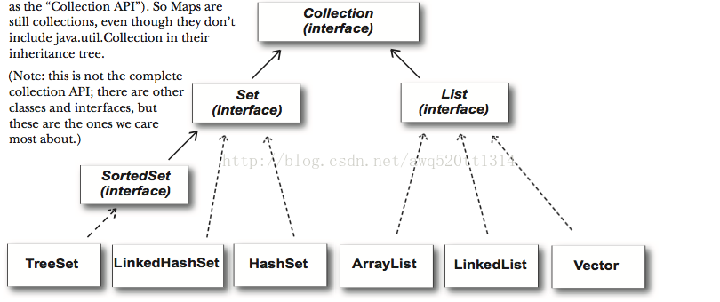
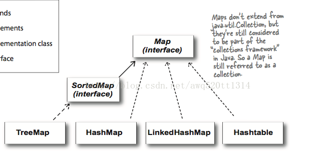

# Collection

### 体系结构





### HashMap的工作原理

HashMap内部是通过一个数组实现的，数组类型为Node，包含key，value，next指针。

```java
transient Node<K,V>[] table;
```

默认容量16，加载因子0.75，扩容一倍

```java
    /**
     * The default initial capacity - MUST be a power of two.
     */
    static final int DEFAULT_INITIAL_CAPACITY = 1 << 4; // aka 16

    /**
     * The maximum capacity, used if a higher value is implicitly specified
     * by either of the constructors with arguments.
     * MUST be a power of two <= 1<<30.
     */
    static final int MAXIMUM_CAPACITY = 1 << 30;

    /**
     * The load factor used when none specified in constructor.
     */
    static final float DEFAULT_LOAD_FACTOR = 0.75f;
```

put时，根据key值进行hash运算，得到hashcode后与数组长度进行取模运算，得到将要放置的数组位置。

- size最开始是0，当放入第一个元素时调用resize扩容

```java
if ((tab = table) == null || (n = tab.length) == 0)
            n = (tab = resize()).length;
```

get时，根据key计算hash，计算出数组下标，再遍历链表比较完整的hashcode。

如果size超过阈值（容量*加载因子），扩容后重排

减少碰撞：使用不可变的或final类作为键值，因为这些类已经重写了equals()和hashcode()。

对于单个桶中元素过多时，超过一定数量（default 8，可指定）会变成红黑树，查询效率O(log n)，小于6恢复成链表。hashcode碰撞次数的泊松分布有关，主要是为了寻找一种时间和空间的平衡。在负载因子0.75（HashMap默认）的情况下，单个hash槽内元素个数为8的概率小于百万分之一。

```java
    /**
     * The bin count threshold for using a tree rather than list for a
     * bin.  Bins are converted to trees when adding an element to a
     * bin with at least this many nodes. The value must be greater
     * than 2 and should be at least 8 to mesh with assumptions in
     * tree removal about conversion back to plain bins upon
     * shrinkage.
     */
    static final int TREEIFY_THRESHOLD = 8;

    /**
     * The bin count threshold for untreeifying a (split) bin during a
     * resize operation. Should be less than TREEIFY_THRESHOLD, and at
     * most 6 to mesh with shrinkage detection under removal.
     */
    static final int UNTREEIFY_THRESHOLD = 6;
```

多线程下冲突链表死循环：当多个线程进行插入操作时刚好发生扩容操作，线程一执行时被挂起，线程二执行完扩容，线程一执行完，两线程对于链表进行的重排序会导致循环引用。当再次调用到其中的get()方法时，会进入死循环。

HashTable是线程安全的，但每次操作都会锁住整个表，效率低下。

ConcurrentHashMap是线程安全的，采用数组+链表多段存储，允许多个线程进行修改操作，关键是锁分离技术，而对于size()等需要跨段的方法，仍需锁住整个表。

因为Entry的value是volatile，不会synchronize读操作也能保证读取到最新的值。

锁分段技术：首先将数据分成一段一段的存储，然后给每一段数据配一把锁，当一个线程占用锁访问其中一个段数据的时候，其他段的数据也能被其他线程访问。

#####  HashMap为什么用红黑树而不是AVL平衡树

 红黑树牺牲了写查找性能，插入删除操作性能高一些。

AVL有严格的平衡策略，适用于查找密集型的任务，而为了维护平衡，增加和删除操作相对于红黑树就要麻烦一些，需要更高的旋转次数。

### ArrayList

扩容：

```java
    /**
     * Default initial capacity.
     */
    private static final int DEFAULT_CAPACITY = 10;
```

full扩容1.5倍

```java
        // overflow-conscious code
        if (minCapacity - elementData.length > 0)
            grow(minCapacity);	

		/**
     * Increases the capacity to ensure that it can hold at least the
     * number of elements specified by the minimum capacity argument.
     *
     * @param minCapacity the desired minimum capacity
     */
    private void grow(int minCapacity) {
        // overflow-conscious code
        int oldCapacity = elementData.length;
        int newCapacity = oldCapacity + (oldCapacity >> 1);
        if (newCapacity - minCapacity < 0)
            newCapacity = minCapacity;
        if (newCapacity - MAX_ARRAY_SIZE > 0)
            newCapacity = hugeCapacity(minCapacity);
        // minCapacity is usually close to size, so this is a win:
        elementData = Arrays.copyOf(elementData, newCapacity);
    }
```

### ConcurrentHashMap

ConcurrentHashMap 采用了分段锁技术，其中 Segment 继承于 ReentrantLock。不会像 HashTable 那样不管是 put 还是 get 操作都需要做同步处理，理论上 ConcurrentHashMap 支持 CurrencyLevel (Segment 数组数量)的线程并发。每当一个线程占用锁访问一个 Segment 时，不会影响到其他的 Segment。