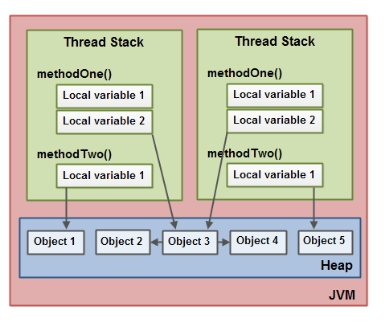

# **JavaSE复习**

### Java内存模型

 

每个线程都持有变量的副本，当需要线程之间通信时，要先改变副本，在提交到堆中。

### Clone方法

java.lang.Cloneable是一个标志性接口，不包含任何方法，clone方法在Object类中定义。clone是一个本地方法，由C或C++实现。

### a=a+b和a+=b

+=隐式的将加操作的结果类型强制转换为持有结果类型。如果两个数值类型相加（比如byte,short,int），首先会将他们强制提升到int类型，再进行加操作

byte a = 127;

byte b = 127;

b = a + b;//error 无法转换int为byte

b += a;

### 数值类型隐式转换

范围大的类型无法隐式转换为范围小的类型。

不能将double赋值给long

强制转换会将高位丢弃

### 3\*0.1 == 0.3

浮点数的表示，用二进制并不能准确的表示出来

0.1 = 1.000/1010 无尽循环

### switch类型

基本数据类型及其包装类型：byte short char int

枚举类型Enum

String（jdk7+，内部实现是用hashcode）

### 基本数据类型

长度与平台无关

- byte 8位

- short 16位

- int 32位

- long 64位

- float 32位

1bit（符号位） 

8bits（指数位） 

23bits（尾数位）

范围：float的范围为-2^128 ~ +2^128

精度：2^23 = 8388608，一共七位，这意味着最多能有7位有效数字，但绝对能保证的为6位，也即float的精度为6~7位有效数字；

- double 64位

- boolean

- char

### BigDecimal

由于浮点类型并不能精确表示数值，所以采用BigDecimal表示价格等信息

构造方法：

public BigDecimal(double val);不建议用，因为本身double就不能精确表示，转换后仍是不精确的。

public BigDecimal(int val)

public BigDecimal(String val)建议采用，double可采用Double.toString(double val) 转换。

### 是否可以覆盖static变量或private变量

由于static变量是属于类的，而private变量对于子类是不可见的，因此无法覆盖。当然可以在子类创建一个同名的方法，这只是子类的一个方法与父类无关。

static方法在编译时是静态绑定的，属于类，而覆盖是运行时动态绑定的，因此不能覆盖。

### JAVA8新特性

1. default关键字

将接口中的方法声明default，即可对该方法默认实现。实现类可直接调用

2. Lambda表达式

函数式编程

将函数作为参数传入到方法中，即可替代匿名内部类。

比如Collections.sort需要一个Comparator接口的实现类，而其实只是需要一个方法比较两个参数

```java
Collections.sort(list, new Comparator<String>() {
    @Override
    public int compare(String o1, String o2) {
        return o2.compareTo(o1);
    }
});
```

Lambda表达式：

```
Collections.sort(list, (Comparator<? super String>) (String a,String b)->{return b.compareTo(a); });
```

或

```
Collections.sort(list, (a,b)->b.compareTo(a));
```

3. 函数式接口

@FunctionalInterface标注一个只有一个普通抽象方法的接口（不包括static和default），以供Lambda表达式调用。

​	MyLamda m = y -> System.out.println("ss"+y);

//y为传入的参数，sysout为MaLamda实现类方法的实现。

4. 方法与构造函数的引用 ClassName::methodName和ClassName::new

//实体类User和它的构造方法

```java
public class User {
	private String name;
	private String sex;
	public User(String name, String sex) {
		super();
		this.name = name;
		this.sex = sex;
	}
}
```

//User工厂

```java
public interface UserFactory {
    User get(String name, String sex);
}
```

//测试类

```java
UserFactory uf = User::new;
User u = uf.get("ww", "man");
```

其中uf为构造函数的方法引用，ww man用过get传入uf引用的方法中返回一个User

5. 局部变量限制

​			即Lambda语句块中可以调用当前变量栈中的变量，这个变量会被解释成final，如果这样引用后对变量修改会报编译期错误。

```java
final int num = 1;
Converter<Integer, String> stringConverter =(from) -> String.valueOf(from + num);
stringConverter.convert(2); 
```

6. Date api ：java.time包下

​			LocalDate为日期处理类、LocalTime为时间处理类、LocalDateTime为日期时间处理类

7. 流Stream

### 死锁条件

1.互斥条件

2.不可剥夺条件

3.请求与保持条件

4.循环等待

### 进程间的通信

1. 管道

管道是一种半双工的通信方式，数据只能单向流动，而且只能在具有亲缘关系的进程间使用。通常指父子进程关系。

2. 有名管道

相比于管道，有名管道可以在无亲缘关系的进程间进行通信。

3. 信号量

信号量是一个计数器，可以用来控制多个进程对共享资源的访问。它常作为一种锁的机制，防止某个进程正在访问资源时，其他进程也访问该资源。因此，主要作为进程间以及同一进程内不同线程之间的同步手段。

4. 消息队列

消息队列是由消息的链表，存放在内核中并由消息队列标识符标识。消息队列克服了信号传递信息少、管道只能承载五个是字节流以及缓冲区大小受限等缺点。

5. 信号

信号是一种比较复杂的通信方式，用于通知接收进程某个事件已经发生。

6. 共享内存

共享内存就是映射一段能被其他进程所访问的内存，这段共享内存由一个进程创建，但多个进程都可以访问。共享内存时最快的IPC方式，他是针对其他进程通信方式运行效率低而专门审计的。它往往与其他通信机制，如信号量配合使用，来实现进程间的同步和通信。

7. 套接字

套接字也是一种进程间的通信机制，与其他通信机制不同的时，它可用于不同机器间的进程通信。

### 序列化

Java实现序列化的两种方式：实现Serializable或Externalizable，其中Externalizable继承Serualizable，区别在于实现Externalizable的对象要自己重写序列化方法。（即可实现transient 的效果）

ObjectOutputStream在序列化时writeObject会判断该类obj instanceof String、cl.isArray()、obj instanceof Enum、obj instanceof Serializable，否则就会抛出对象不可序列化的异常。

在序列化对象时，不仅会序列化当前对象本身，还会对该对象引用的其它对象也进行序列化，如此引用传递序列化。如果一个对象包含的成员变量是容器类等并深层引用，那么序列化过程开销也较大。

声明为static和transient类型的成员数据不能被序列化。因为static代表类的状态，而序列化保存实例的状态；transient代表对象的临时数据。

ArrayList 序列化和反序列化的实现 ：ArrayList 中存储数据的数组是用 transient 修饰的，因为这个数组是动态扩展的，并不是所有的空间都被使用，因此就不需要所有的内容都被序列化。通过重写序列化和反序列化方法，使得可以只序列化数组中有内容的那部分数据。

###  String、StringBuffer、StringBuilder

**String**被声明为final class，除了hash其他属性都是final，因为它的不可变性，所以在拼接字符串时会产生很多无用的中间对象。

**StringBuffer**就是为了解决String在拼接时产生的中间对象问题，提供append和add，它本质是一个线程安全的字符序列，把所有修改数据的方法都加上synchronized。但是为了保证线程安全，在性能上要付出一些代价。

**StringBuilder**去掉了StringBuffer的线程安全部分。

StringBuffer和StringBuilder都继承了AbstractStringBuilder，底层都是利用可修改的char[]（JDK9以后是byte[]）

所以如果我们有大量的字符串拼接，如果能预知大小的话最好在new StringBuffer 或者StringBuilder 的时候设置好capacity，避免多次扩容的开销。扩容要抛弃原有数组，还要进行数组拷贝创建新的数组。

###  异常类型

异常分为检查性异常和非检查性异常，对于非检查性异常也叫RuntimeException，对于非检查性异常的几种处理方式：

- 捕获
- 继续抛出
- 不处理


Exception是程序正常运行中可以预料的意外情况，可能并且应该被捕获，进行相应处理。Error则是指在正常情况下，不大可能出现的情况，绝大部分的Error都会导致程序（比如JVM）处于非正常的、不可恢复状态。既然是非正常情况，所以不便于也不需要捕获，常见的比如OutOfMemoryError，其为Error的子类。

NoClassDefFoundError 由虚拟机抛出，编译的时候存在，编译后运行时找不到class

ClassNotFoundException 当动态加载一些类找不到时抛出。

### Object的方法

hashCode():int

equals(Object obj):boolean

clone():Object

toString():String

finialize():void


final:

wait()

notify()/notifyAll()

### hashCode和equal方法

hashCode的存在是为了在一些散列的比较中提高equal的效率，先找出hashCode相等的元素再进行比较。

所以，就要求当equal为true时，hashCode也必须相等，反之则不然（hash冲突）

### 深拷贝与浅拷贝

同值传递与引用传递，深拷贝是一个新的对象，属性都与原对象相等，而浅拷贝只是拷贝引用地址，是同一个对象。

java的clone是浅拷贝。


