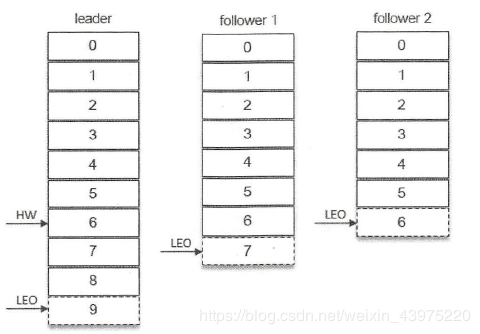

# Kafka

## ISR,AR,HW,LEO,LSO,LW

### AR,ISR,OSR

分区中的所有副本统称为AR。与leader副本保持一定程度同步的副本（包括Leader）属于ISR（In-Sync Replicas）。

由于Kafka采用特殊的同步机制，Leader与followers在接到message后，Leader发送消息到Leader通知同步，而后Leader开始同步，期间部分Follower副本相对于Leader副本会有一定程度的滞后。与Leader副本同步滞后过多的副本属于OSR（Out-Sync Relipcas）。AR = ISR + OSR。正常情况下OSR集合为空。

Leader副本负责维护和跟踪ISR集合中所有Follower副本的滞后状态，当某一个Follower副本滞后过多时，Leader副本会从ISR中剔除该副本。

只有ISR中的副本才有资格被选为Leader。

### ISR的伸缩

定时任务：

isr-expiration：定时检查ISR，将失效的副本剔除，并生成ISR变更记录/brokers/topics//partition/state，{“controller_cpoch":26,“leader”:0,“version”:1,“leader_epoch”:2,“isr”:{0,1}}

controller_cpoch kafka控制器

leader Leader所属Broker编号

isr 变更后ISR集合

并缓存到isrChangeSet

isr-change-propagation：周期性检查isrChangeSet，如果有变更则在/isr_change_notification下生成新节点，由控制器生成的Watcher监控，通知控制器与Broker更新相关元数据信息，最后删除该节点。

### LEO,HW

LEO 当前副本下一新消息的offset

HW 高水位，ISR中最大LEO，消费只能拉取到HW之前的消息。（部分Follower没有之后的消息）

