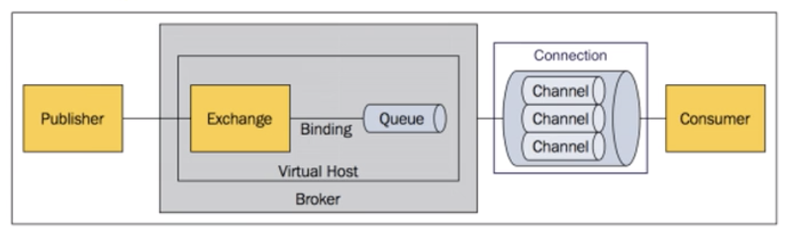

# RabbitMQ

### 1.rabbitmq介绍

rabbitmq提供amqp（高级消息队列协议）实现，Erlang编写

### 2.JMS与AMQP

JMS

提供两种消息模型：

- 点对点
- 发布订阅

由message-routing决定，producer与consumer连接至同一个queue(p2p)或topic(pub-sub)来实现消息路由

消息路由机制：producer->queue->consumer

因为是J-Java，在跨平台特性上比较差

AMQP

提供五种消息模型：

- direct exchange(p2p)
- fanout exchange(广播) 
- topic exchange(匹配)
- header exchange
- system exchange

消息路由机制：producer->exchange->binding->queue->consumer

使用http协议，具有跨平台特性

### Rabbitmq对AMQP的实现

核心：

**Message**:消息头和消息体组成，消息体是不透明的，而消息头上则是由一系列的可选属性组成，属性：路由键【routing-key】,优先级【priority】,指出消息可能需要持久性存储【delivery-mode】

**Publisher**:消息的生产者，也是一个向交换器发布消息的客户端应用程序

**Exchange**:交换器，用来接收生产者发送的消息并将这些消息路由给服务器中的队列

Exchange的4中类型：direct【默认】点对点，fanout,topic和headers, 发布订阅，不同类型的Exchange转发消息的策略有所区别

**Queue**:消息队列，用来保存消息直到发送给消费者，它是消息的容器，也是消息的终点，一个消息可投入一个或多个队列，消息一直在队列里面，等待消费者连接到这个队列将数据取走。

**Binding**:绑定，队列和交换机之间的关联，多对多关系

**Connection**:网络连接，例如TCP连接

Channel:信道，多路复用连接中的一条独立的双向数据流通道，信道是建立在真是的TCP链接之内的虚拟连接AMQP命令都是通过信道发送出去的。不管是发布消息，订阅队列还是接受消息，都是信道，减少TCP的开销，复用一条TCP连接。

**Consumer**:消息的消费者，表示一个从消息队列中取得消息的客户端的 应用程序

**VirtualHost**:小型的rabbitMQ,相互隔离

**Broker**:表示消息队列 服务实体

