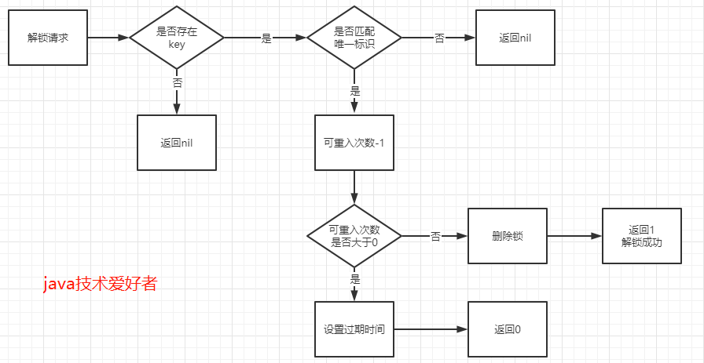

# Redis分布式锁

### 目的

为了保证一段代码在集群不同节点里只有一个节点在运行。

### 关键

1. 互斥性，保证只有一个客户端持有锁
2. 不能出现死锁
3. 保证上锁的和解锁的是同一个客户端

### 其他实现

- MySQL唯一索引
- Zookeeper的临时有序节点
- Redis的setnx+timeout

```java
作者：阿里技术
链接：https://www.zhihu.com/question/300767410/answer/1749442787
来源：知乎

private static Jedis jedis = new Jedis("127.0.0.1");

private static final Long SUCCESS = 1L;

/**
  * 加锁
  */
public boolean tryLock(String key, String requestId, int expireTime) {
    //使用jedis的api，保证原子性
    //NX 不存在则操作 EX 设置有效期，单位是秒
    String result = jedis.set(key, requestId, "NX", "EX", expireTime);
    //返回OK则表示加锁成功
    return "OK".equals(result);
}

//删除key的lua脚本，先比较requestId是否相等，相等则删除
//解锁使用lua脚本而不是java，是避免单机多次解锁
private static final String DEL_SCRIPT = "if redis.call('get', KEYS[1]) == ARGV[1] then return redis.call('del', KEYS[1]) else return 0 end";

/**
  * 解锁
  */
public boolean unLock(String key, String requestId) {
    //删除成功表示解锁成功
    Long result = (Long) jedis.eval(DEL_SCRIPT, Collections.singletonList(key), Collections.singletonList(requestId));
    return SUCCESS.equals(result);
}
```

### 可重入

在Redisson实现可重入锁的思路，使用Redis的哈希表存储可重入次数，当加锁成功后，使用`hset`命令，value(重入次数)则是1。

```lua
"if (redis.call('exists', KEYS[1]) == 0) then " +
"redis.call('hset', KEYS[1], ARGV[2], 1); " +
"redis.call('pexpire', KEYS[1], ARGV[1]); " +
"return nil; " +
"end; "
```

如果同一个客户端再次加锁成功，则使用`hincrby`自增加一。

```lua
"if (redis.call('hexists', KEYS[1], ARGV[2]) == 1) then " +
"redis.call('hincrby', KEYS[1], ARGV[2], 1); " +
"redis.call('pexpire', KEYS[1], ARGV[1]); " +
"return nil; " +
"end; " +
"return redis.call('pttl', KEYS[1]);"
```


解锁时，先判断可重复次数是否大于0，大于0则减一，否则删除键值，释放锁资源。

```java
protected RFuture<Boolean> unlockInnerAsync(long threadId) {
    return commandExecutor.evalWriteAsync(getName(), LongCodec.INSTANCE, RedisCommands.EVAL_BOOLEAN,
"if (redis.call('hexists', KEYS[1], ARGV[3]) == 0) then " +
"return nil;" +
"end; " +
"local counter = redis.call('hincrby', KEYS[1], ARGV[3], -1); " +
"if (counter > 0) then " +
"redis.call('pexpire', KEYS[1], ARGV[2]); " +
"return 0; " +
"else " +
"redis.call('del', KEYS[1]); " +
"redis.call('publish', KEYS[2], ARGV[1]); " +
"return 1; "+
"end; " +
"return nil;",
Arrays.<Object>asList(getName(), getChannelName()), LockPubSub.UNLOCK_MESSAGE, internalLockLeaseTime, getLockName(threadId));
}
```

加锁


解锁



### 重试性能

上面的加锁方法是加锁后立即返回加锁结果，如果加锁失败的情况下，总不可能一直轮询尝试加锁，直到加锁成功为止，这样太过耗费性能。所以需要利用发布订阅的机制进行优化。

步骤如下：

当加锁失败后，订阅锁释放的消息，自身进入阻塞状态。

当持有锁的客户端释放锁的时候，发布锁释放的消息。

当进入阻塞等待的其他客户端收到锁释放的消息后，解除阻塞等待状态，再次尝试加锁。

