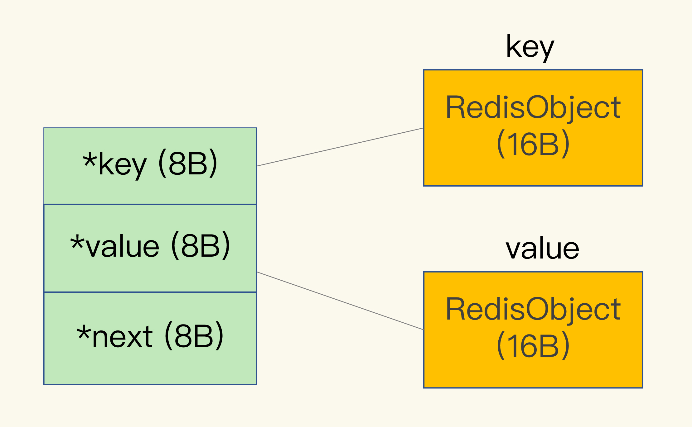
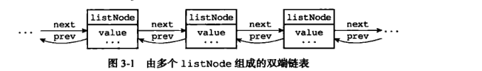
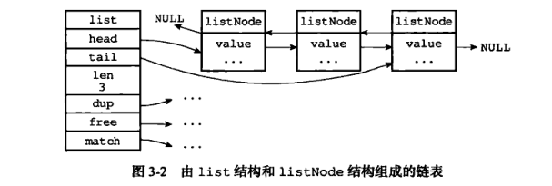
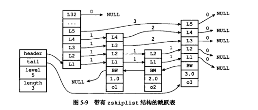
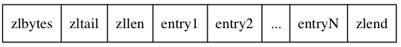
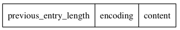
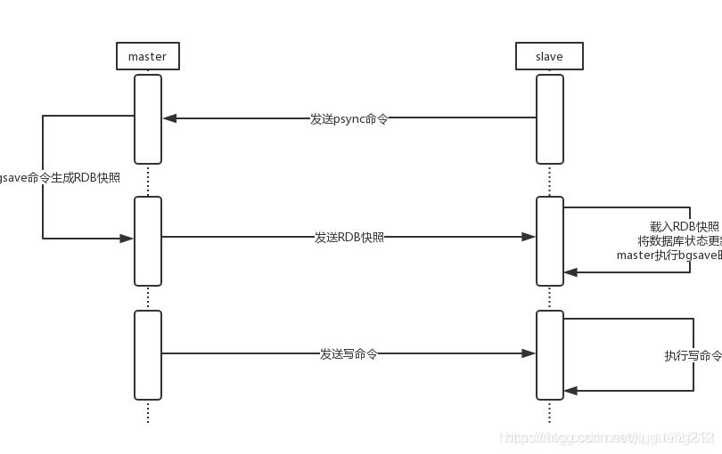

# Redis

## 数据结构


### 哈希表

##### 全局哈希表


计算键的哈希值，就可以知道它所对应的哈希桶位置，然后就可以访问相应的 entry 元素。(O(1))

链式哈希：**解决哈希冲突**。同一个哈希桶中的多个元素用一个链表来保存，它们之间依次用指针连接。

entry:(jemalloc 分配内存32字节)




##### rehash

- 缩容： Redis 定时任务 serverCron 会在每个周期内检查 bucket 的使用情况。
  - 当存放 key 的数量和总 bucket 数的比例小于 HASHTABLE_MIN_FILL(10%)，触发缩容 Rehash 操作。
- 扩容：在每次调用 dictAddRaw 新增数据时，会检查 bucket 的使用比例。扩容的条件是以下之一：
  - dict_can_resize = 1 (该参数会在有 COW 操作的子进程运行时更新为 0，防止在子进程操作过程中触发 Rehash，导致内核进行大量的 Page 复制操作)
  - 当前存放的 key 的数量与 bucket 数量的比例超过了 dict_force_resize_ratio(5)

渐进式哈希：

为了使 rehash 操作更高效，Redis 默认使用了两个全局哈希表：哈希表 1 和哈希表 2。一开始，当你刚插入数据时，默认使用哈希表 1，此时的哈希表 2 并没有被分配空间。随着数据逐步增多，Redis 开始执行 rehash，这个过程分为三步：

1. 给哈希表 2 分配更大的空间，例如是当前哈希表 1 大小的两倍；
2. 把哈希表 1 中的数据重新映射并拷贝到哈希表 2 中；
3. 释放哈希表 1 的空间。

到此，我们就可以从哈希表 1 切换到哈希表 2，用增大的哈希表 2 保存更多数据，而原来的哈希表 1 留作下一次 rehash 扩容备用。

在第二步拷贝数据时，Redis 仍然正常处理客户端请求，每处理一个请求时，从哈希表 1 中的第一个索引位置开始，顺带着将这个索引位置上的所有 entries 拷贝到哈希表 2 中；等处理下一个请求时，再顺带拷贝哈希表 1 中的下一个索引位置的 entries。


### SDS

##### 结构

Redis的string类型一共有三种存储方式，当字符串长度小于等于44，底层采用embstr，实际的数据和RedisObject在内存中地址相邻；当字符串长度大于44，底层采用raw，实际的数据和RedisObject在内存中地址不相邻；当设置是整数，底层则采用int。

```c
struct __attribute__ ((__packed__)) sdshdr8 {
    uint8_t len; /* 已使用长度 */
    uint8_t alloc; /* 总长度*/
    unsigned char flags; // 8位的标记
    char buf[];//实际数据的指针
};
```

作用：

1. 杜绝缓冲区溢出（分配前检查容量）
2. 减少修改字符串长度时所需的内存重分配次数
3. 惰性空间释放（不立即释放free）


##### 扩容

如果目前的字符串小于1M，则直接扩容双倍，如果目前的字符串大于1M，则直接添加1M

### 双向链表

```C
typedef struct listNode{
      struct listNode *prev;
      struct listNode * next;
      void * value;  
}
```



```C
typedef struct list{
    //表头节点
    listNode  * head;
    //表尾节点
    listNode  * tail;
    //链表长度
    unsigned long len;
    //节点值复制函数
    void *(*dup) (void *ptr);
    //节点值释放函数
    void (*free) (void *ptr);
    //节点值对比函数
    int (*match)(void *ptr, void *key);
}
```



特性：

- 双端：获取前置节点与后置节点复杂度O(1)
- 无环
- 头尾：获取头节点和尾节点复杂度O(1)
- 计数：获取len复杂度O(1)

### 跳表




### **压缩列表**

压缩列表数据结构：



zlbytes：记录整个压缩列表占用的内存字节数。

zltail：记录压缩列表表尾节点距离压缩列表起始地址有多少字节。

zllen：记录了压缩列表包含的节点数量。

entryN：压缩列表的节点，节点长度由节点保存的内容决定。

zlend：特殊值0xFF（十进制255），用于标记压缩列表的末端。

节点数据结构：



previous_entry_length：记录压缩列表中前一个节点的长度。previous_entry_length属性的长度可以是1字节或者5字节：如果前一节点的长度小于 254 字节，那么previous_entry_length属性的长度为1字节，前一节点的长度就保存在这一个字节里面。如果前一节点的长度大于等于254字节，那么previous_entry_length属性的长度为5字节，其中属性的第一字节会被设置为0xFE（十进制值 254），而之后的四个字节则用于保存前一节点的长度。因为节点的previous_entry_length属性记录了前一个节点的长度，所以程序可以通过指针运算，根据当前节点的起始地址来计算出前一个节点的起始地址，缩列表的从表尾向表头遍历操作就是使用这一原理实现的。

encoding：记录节点的contents属性所保存数据的类型以及长度。分两种情况：（1）一字节、两字节或者五字节长，值的最高位为00 、01或者10的是字节数组编码，这种编码表示节点的content属性保存着字节数组，数组的长度由编码除去最高两位之后的其他位记录；（2）一字节长，值的最高位以11开头的是整数编码，这种编码表示节点的content属性保存着整数值，整数值的类型和长度由编码除去最高两位之后的其他位记录。

contents：保存节点的值，可以是一个字节数组或整数，类型和长度由节点的'encoding'属性决定。

作用：

1. 作为列表键的底层实现之一：当一个列表键只包含少量列表项，并且每个列表项要么就是小整数值，要么就是长度比较短的字符串，那么Redis就会使用压缩列表来做列表键的底层实现。
2. 作为哈希键的底层实现之一：当一个哈希键只包含少量键值对，并且每个键值对的键和值要么就是小整数值，要么就是长度比较短的字符串，那么Redis就会使用压缩列表来做哈希键的底层实现。

## 过期删除策略

定时删除：set时设置计时器，ttl时间到了马上删除。

定期删除：每隔一段时间扫过期键删除。

惰性删除：过期后get，再删除。

redis官方文档：

> ## Redis如何淘汰过期的keys
>
> Redis keys过期有两种方式：被动和主动方式。
>
> 当一些客户端尝试访问它时，key会被发现并主动的过期。
>
> 当然，这样是不够的，因为有些过期的keys，永远不会访问他们。 无论如何，这些keys应该过期，所以定时随机测试设置keys的过期时间。所有这些过期的keys将会从密钥空间删除。
>
> 具体就是Redis每秒10次做的事情：
>
> 1. 测试随机的20个keys进行相关过期检测。
> 2. 删除所有已经过期的keys。
> 3. 如果有多于25%的keys过期，重复步奏1.
>
> 这是一个平凡的概率算法，基本上的假设是，我们的样本是这个密钥控件，并且我们不断重复过期检测，直到过期的keys的百分百低于25%,这意味着，在任何给定的时刻，最多会清除1/4的过期keys。

## 淘汰策略


##### Noevction

不淘汰，数据写满之后直接返回错误。

设置过期时间：在过期后，或空间满

##### 过期时间

- volatile-ttl 在筛选时，会针对设置了过期时间的键值对，根据过期时间的先后进行删除，越早过期的越先被删除。
- volatile-random 就像它的名称一样，在设置了过期时间的键值对中，进行随机删除。
- volatile-lru 会使用 LRU 算法筛选设置了过期时间的键值对。
- volatile-lfu 会使用 LFU 算法选择设置了过期时间的键值对。

##### 无过期时间

这三种淘汰策略的备选淘汰数据范围，就扩大到了所有键值对，无论这些键值对是否设置了过期时间。

##### LRU实现的简化：

Redis 默认会记录每个数据的最近一次访问的时间戳（由键值对数据结构 RedisObject 中的 lru 字段记录）。然后，Redis 在决定淘汰的数据时，第一次会随机选出 N 个数据（maxmemory-samples），把它们作为一个候选集合。接下来，Redis 会比较这 N 个数据的 lru 字段，把 lru 字段值最小的数据从缓存中淘汰出去。第二次筛选能进入候选集合的数据的 lru 字段值必须小于候选集合中最小的 lru 值。这样不用维护LRU链表，节省了空间开销，也不用在每次数据访问时都移动链表项。全局最优解退化为局部最优解。

##### LFU

有效解决缓存污染：键值只使用一次

LFU 缓存策略是在 LRU 策略基础上，为每个数据增加了一个计数器，来统计这个数据的访问次数。当使用 LFU 策略筛选淘汰数据时，首先会根据数据的访问次数进行筛选，把访问次数最低的数据淘汰出缓存。如果两个数据的访问次数相同，LFU 策略再比较这两个数据的访问时效性，把距离上一次访问时间更久的数据淘汰出缓存。

Redis 在实现 LFU 策略的时候，只是把原来 24bit 大小的 lru 字段，又进一步拆分成了两部分。ldt 值：lru 字段的前 16bit，表示数据的访问时间戳；counter 值：lru 字段的后 8bit(255)，表示数据的访问次数。

在实现 LFU 策略时，Redis 并没有采用数据每被访问一次，就给对应的 counter 值加 1 的计数规则，而是采用了一个更优化的计数规则。非线性递增的计数器方法


为避免某一键值只在一段时间内大量访问，LFU 策略使用衰减因子配置项 lfu_decay_time 来控制访问次数的衰减（主线程执行，请求到的key才会触发计算。）。LFU 策略会计算当前时间和数据最近一次访问时间的差值，并把这个差值换算成以分钟为单位。然后，LFU 策略再把这个差值除以 lfu_decay_time 值，所得的结果就是数据 counter 要衰减的值。简单举个例子，假设 lfu_decay_time 取值为 1，如果数据在 N 分钟内没有被访问，那么它的访问次数就要减 N。

## 持久化

### AOF

#### 内容

我们以 Redis 收到“set testkey testvalue”命令后记录的日志为例，看看 AOF 日志的内容。其中，“*3”表示当前命令有三个部分，每部分都是由“\$ +数字”开头，后面紧跟着具体的命令、键或值。这里，“数字”表示这部分中的命令、键或值一共有多少字节。例如，“\$3 set”表示这部分有 3 个字节，也就是“set”命令。

#### 机制

AOF日志写入是发生在命令执行返回**之后**的，这也就意味着AOF写入不会影响**当前请求**的性能，所以AOF也不需要对命令进行语法检查。

但这并不是说完全不会影响Redis的性能，AOF也是在主线程上执行的，如果AOF写入过慢，会给下一个操作带来阻塞风险。

#### 写入时机

- Always：每次命令执行后写入磁盘
- EverySec：每秒写一次磁盘（丢失一秒数据）
- No：不主动写入，由操作系统控制（丢失数据多）

#### AOF重写

##### 文件大小

一是，文件系统本身对文件大小有限制，无法保存过大的文件；二是，如果文件太大，之后再往里面追加命令记录的话，效率也会变低；三是，如果发生宕机，AOF 中记录的命令要一个个被重新执行，用于故障恢复，如果日志文件太大，整个恢复过程就会非常缓慢，这就会影响到 Redis 的正常使用。

##### 重写过程

AOF 持久化是通过保存被执行的写命令来记录数据库状态的，所以AOF文件的大小随着时间的流逝一定会越来越大；影响包括但不限于：对于Redis服务器，计算机的存储压力；AOF还原出数据库状态的时间增加；

- AOF重写并不需要对原有AOF文件进行任何的读取，写入，分析等操作，这个功能是通过读取服务器当前的数据库状态来实现的。

重写过程是由后台子进程 bgrewriteaof 来完成的

“一个拷贝”就是指，每次执行重写时，主线程 fork 出后台的 bgrewriteaof 子进程。此时，fork 会把主线程的内存拷贝一份给 bgrewriteaof 子进程（拷贝页表地址），这里面就包含了数据库的最新数据。然后，bgrewriteaof 子进程就可以在不影响主线程的情况下，逐一把拷贝的数据写成操作，记入重写日志。

“两处写入”重写也是需要时间的，期间主线程仍可正常处理请求，重写过程中新操作会被写入到原AOF日志与新AOF重写日志两处**缓冲区**。

##### 重写时机

1. auto-aof-rewrite-min-size: 表示运行AOF重写时文件的最小大小，默认为64MB
2. auto-aof-rewrite-percentage: 这个值的计算方法是：当前AOF文件大小和上一次重写后AOF文件大小的差值，再除以上一次重写后AOF文件大小。也就是当前AOF文件比上一次重写后AOF文件的增量大小，和上一次重写后AOF文件大小的比值。

同时触发这两个配置项时开启重写。

##### 性能问题

fork子进程这个瞬间一定是会阻塞主线程的fork子进程，需要拷贝进程必要的数据结构，其中有一项就是拷贝内存页表（虚拟内存和物理内存的映射索引表），这个拷贝过程会消耗大量CPU资源，拷贝完成之前整个进程是会阻塞的，阻塞时间取决于整个实例的内存大小，实例越大，内存页表越大，fork阻塞时间越久。

copy-on-write

**AOF重写不复用AOF本身的日志**，一个原因是使用同一个日志，父子进程使用相同的文件，相当于竞态资源，就不可避免的要考虑同步访问，性能也会有下降。另一个原因是安全性考虑，使用新的文件不会影响原文件操作，如果重写失败了可以直接删除重写文件就好。

### RDB

记录的是某一时刻的数据.

#### 时机

- save：在主线程中执行，会导致阻塞；
- bgsave：创建一个子进程，专门用于写入 RDB 文件，避免了主线程的阻塞，这也是 Redis RDB 文件生成的默认配置。

bgsave期间如果修改键，这个数据会被复制一份，子进程将副本写入到RDB文件中。

频繁bgsave问题：一方面，频繁将全量数据写入磁盘，会给磁盘带来很大压力，多个快照竞争有限的磁盘带宽，前一个快照还没有做完，后一个又开始做了，容易造成恶性循环。另一方面，bgsave 子进程需要通过 fork 操作从主线程创建出来。虽然，子进程在创建后不会再阻塞主线程，但是，fork 这个创建过程本身会阻塞主线程，而且主线程的内存越大，阻塞时间越长。如果频繁 fork 出 bgsave 子进程，这就会频繁阻塞主线程了。

> 2核CPU、4GB内存、500G磁盘，Redis实例占用2GB，写读比例为8:2，此时做RDB持久化，产生的风险主要在于 CPU资源 和 内存资源 这2方面：
>
> a、内存资源风险：Redis fork子进程做RDB持久化，由于写的比例为80%，那么在持久化过程中，“写实复制”会重新分配整个实例80%的内存副本，大约需要重新分配1.6GB内存空间，这样整个系统的内存使用接近饱和，如果此时父进程又有大量新key写入，很快机器内存就会被吃光，如果机器开启了Swap机制，那么Redis会有一部分数据被换到磁盘上，当Redis访问这部分在磁盘上的数据时，性能会急剧下降，已经达不到高性能的标准（可以理解为武功被废）。如果机器没有开启Swap，会直接触发OOM，父子进程会面临被系统kill掉的风险。
>
> b、CPU资源风险：虽然子进程在做RDB持久化，但生成RDB快照过程会消耗大量的CPU资源，虽然Redis处理处理请求是单线程的，但Redis Server还有其他线程在后台工作，例如AOF每秒刷盘、异步关闭文件描述符这些操作。由于机器只有2核CPU，这也就意味着父进程占用了超过一半的CPU资源，此时子进程做RDB持久化，可能会产生CPU竞争，导致的结果就是父进程处理请求延迟增大，子进程生成RDB快照的时间也会变长，整个Redis Server性能下降。
>
> c、另外，可以再延伸一下，老师的问题没有提到Redis进程是否绑定了CPU，如果绑定了CPU，那么子进程会继承父进程的CPU亲和性属性，子进程必然会与父进程争夺同一个CPU资源，整个Redis Server的性能必然会受到影响！所以如果Redis需要开启定时RDB和AOF重写，进程一定不要绑定CPU。

##### RDB与AOF混用

https://time.geekbang.org/column/article/271839

## Redis是如何保证主从数据一致性的

### 初次同步

redis的主从复制是，当一个redis从节点连接到主库上时，向主库发送psync命令，在主库上执行bgsave命令，并把生成的rdb文件下载到从库上，结束后再发送缓冲区的命令。



通常主从模式是主库写从库读，如果要求主从数据强一致性，那么这种模式就不适合这样的场景，通常的做法是，不使用主从模式，为了缓解压力可以根据Hash槽或业务进行拆分，读写都在同一个实例上。为了保证高可用可对每个实例设置从节点，但不进行读写操作。

### 断线重连

实际上当slave发送psync命令给master之后，master还需要根据以下三点判断是否进行部分同步。

先来介绍一下是哪三个方面：

**服务器运行ID**

每个redis服务器开启后会生成运行ID。

当进行初次同步时，master会将自己的ID告诉slave，slave会记录下来，当slave断线重连后，发现ID是这个master的就会尝试进行部分重同步。当ID与现在连接的master不一样时会进行完整重同步。

**复制偏移量**

复制偏移量包括master复制偏移量和slave复制偏移量，当初次同步过后两个数据库的复制偏移量相同，之后master执行一次写命令，那么master的偏移量+1，master将写命令给slave，slave执行一次，slave偏移量+1，这样版本就能一致。

**复制积压缓冲区**

复制积压缓冲区是由master维护的固定长度的先进先出的队列。

当slave发送psync，会将自己的偏移量也发送给master，当slave的偏移量之后的数据在缓冲区还存在，就会返回+continue通知slave进行部分重同步。

当slave的偏移量之后的数据不在缓冲区了，就会进行完整重同步。