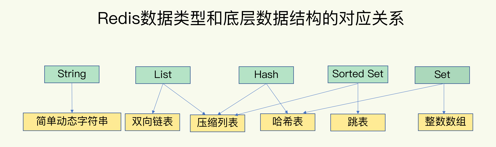
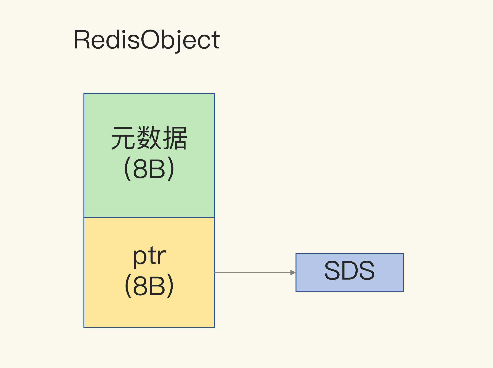

# Redis

## 数据结构



### 哈希表

##### 全局哈希表


计算键的哈希值，就可以知道它所对应的哈希桶位置，然后就可以访问相应的 entry 元素。(O(1))

链式哈希：**解决哈希冲突**。同一个哈希桶中的多个元素用一个链表来保存，它们之间依次用指针连接。

entry:(jemalloc 分配内存32字节)




##### rehash

- 缩容： Redis 定时任务 serverCron 会在每个周期内检查 bucket 的使用情况。
  - 当存放 key 的数量和总 bucket 数的比例小于 HASHTABLE_MIN_FILL(10%)，触发缩容 Rehash 操作。
- 扩容：在每次调用 dictAddRaw 新增数据时，会检查 bucket 的使用比例。扩容的条件是以下之一：
  - dict_can_resize = 1 (该参数会在有 COW 操作的子进程运行时更新为 0，防止在子进程操作过程中触发 Rehash，导致内核进行大量的 Page 复制操作)
  - 当前存放的 key 的数量与 bucket 数量的比例超过了 dict_force_resize_ratio(5)

渐进式哈希：

为了使 rehash 操作更高效，Redis 默认使用了两个全局哈希表：哈希表 1 和哈希表 2。一开始，当你刚插入数据时，默认使用哈希表 1，此时的哈希表 2 并没有被分配空间。随着数据逐步增多，Redis 开始执行 rehash，这个过程分为三步：

1. 给哈希表 2 分配更大的空间，例如是当前哈希表 1 大小的两倍；
2. 把哈希表 1 中的数据重新映射并拷贝到哈希表 2 中；
3. 释放哈希表 1 的空间。

到此，我们就可以从哈希表 1 切换到哈希表 2，用增大的哈希表 2 保存更多数据，而原来的哈希表 1 留作下一次 rehash 扩容备用。

在第二步拷贝数据时，Redis 仍然正常处理客户端请求，每处理一个请求时，从哈希表 1 中的第一个索引位置开始，顺带着将这个索引位置上的所有 entries 拷贝到哈希表 2 中；等处理下一个请求时，再顺带拷贝哈希表 1 中的下一个索引位置的 entries。


### SDS

##### 结构

Redis的string类型一共有三种存储方式，当字符串长度小于等于44，底层采用embstr，实际的数据和RedisObject在内存中地址相邻；当字符串长度大于44，底层采用raw，实际的数据和RedisObject在内存中地址不相邻；当设置是整数，底层则采用int。

```c
struct __attribute__ ((__packed__)) sdshdr8 {
    uint8_t len; /* 已使用长度 */
    uint8_t alloc; /* 总长度*/
    unsigned char flags; // 8位的标记
    char buf[];//实际数据的指针
};
```

作用：

1. 杜绝缓冲区溢出（分配前检查容量）
2. 减少修改字符串长度时所需的内存重分配次数
3. 惰性空间释放（不立即释放free）


##### 扩容

如果目前的字符串小于1M，则直接扩容双倍，如果目前的字符串大于1M，则直接添加1M

### 双向链表

```C
typedef struct listNode{
      struct listNode *prev;
      struct listNode * next;
      void * value;  
}
```


```C
typedef struct list{
    //表头节点
    listNode  * head;
    //表尾节点
    listNode  * tail;
    //链表长度
    unsigned long len;
    //节点值复制函数
    void *(*dup) (void *ptr);
    //节点值释放函数
    void (*free) (void *ptr);
    //节点值对比函数
    int (*match)(void *ptr, void *key);
}
```


特性：

- 双端：获取前置节点与后置节点复杂度O(1)
- 无环
- 头尾：获取头节点和尾节点复杂度O(1)
- 计数：获取len复杂度O(1)

### 跳表


### **压缩列表**

压缩列表数据结构：


zlbytes：记录整个压缩列表占用的内存字节数。
zltail：记录压缩列表表尾节点距离压缩列表起始地址有多少字节。
zllen：记录了压缩列表包含的节点数量。
entryN：压缩列表的节点，节点长度由节点保存的内容决定。
zlend：特殊值0xFF（十进制255），用于标记压缩列表的末端。

节点数据结构：


previous_entry_length：记录压缩列表中前一个节点的长度。previous_entry_length属性的长度可以是1字节或者5字节：如果前一节点的长度小于 254 字节，那么previous_entry_length属性的长度为1字节，前一节点的长度就保存在这一个字节里面。如果前一节点的长度大于等于254字节，那么previous_entry_length属性的长度为5字节，其中属性的第一字节会被设置为0xFE（十进制值 254），而之后的四个字节则用于保存前一节点的长度。因为节点的previous_entry_length属性记录了前一个节点的长度，所以程序可以通过指针运算，根据当前节点的起始地址来计算出前一个节点的起始地址，缩列表的从表尾向表头遍历操作就是使用这一原理实现的。
encoding：记录节点的contents属性所保存数据的类型以及长度。分两种情况：（1）一字节、两字节或者五字节长，值的最高位为00 、01或者10的是字节数组编码，这种编码表示节点的content属性保存着字节数组，数组的长度由编码除去最高两位之后的其他位记录；（2）一字节长，值的最高位以11开头的是整数编码，这种编码表示节点的content属性保存着整数值，整数值的类型和长度由编码除去最高两位之后的其他位记录。
contents：保存节点的值，可以是一个字节数组或整数，类型和长度由节点的'encoding'属性决定。

作用：

1. 作为列表键的底层实现之一：当一个列表键只包含少量列表项，并且每个列表项要么就是小整数值，要么就是长度比较短的字符串，那么Redis就会使用压缩列表来做列表键的底层实现。
2. 作为哈希键的底层实现之一：当一个哈希键只包含少量键值对，并且每个键值对的键和值要么就是小整数值，要么就是长度比较短的字符串，那么Redis就会使用压缩列表来做哈希键的底层实现。

## 淘汰策略


##### Noevction

不淘汰，数据写满之后直接返回错误。

设置过期时间：在过期后，或空间满

##### 过期时间

- volatile-ttl 在筛选时，会针对设置了过期时间的键值对，根据过期时间的先后进行删除，越早过期的越先被删除。
- volatile-random 就像它的名称一样，在设置了过期时间的键值对中，进行随机删除。
- volatile-lru 会使用 LRU 算法筛选设置了过期时间的键值对。
- volatile-lfu 会使用 LFU 算法选择设置了过期时间的键值对。

##### 无过期时间

这三种淘汰策略的备选淘汰数据范围，就扩大到了所有键值对，无论这些键值对是否设置了过期时间。

##### LRU实现的简化：

Redis 默认会记录每个数据的最近一次访问的时间戳（由键值对数据结构 RedisObject 中的 lru 字段记录）。然后，Redis 在决定淘汰的数据时，第一次会随机选出 N 个数据（maxmemory-samples），把它们作为一个候选集合。接下来，Redis 会比较这 N 个数据的 lru 字段，把 lru 字段值最小的数据从缓存中淘汰出去。第二次筛选能进入候选集合的数据的 lru 字段值必须小于候选集合中最小的 lru 值。这样不用维护LRU链表，节省了空间开销，也不用在每次数据访问时都移动链表项。全局最优解退化为局部最优解。

##### LFU

有效解决缓存污染：键值只使用一次

LFU 缓存策略是在 LRU 策略基础上，为每个数据增加了一个计数器，来统计这个数据的访问次数。当使用 LFU 策略筛选淘汰数据时，首先会根据数据的访问次数进行筛选，把访问次数最低的数据淘汰出缓存。如果两个数据的访问次数相同，LFU 策略再比较这两个数据的访问时效性，把距离上一次访问时间更久的数据淘汰出缓存。

Redis 在实现 LFU 策略的时候，只是把原来 24bit 大小的 lru 字段，又进一步拆分成了两部分。ldt 值：lru 字段的前 16bit，表示数据的访问时间戳；counter 值：lru 字段的后 8bit(255)，表示数据的访问次数。

在实现 LFU 策略时，Redis 并没有采用数据每被访问一次，就给对应的 counter 值加 1 的计数规则，而是采用了一个更优化的计数规则。非线性递增的计数器方法


为避免某一键值只在一段时间内大量访问，LFU 策略使用衰减因子配置项 lfu_decay_time 来控制访问次数的衰减（主线程执行，请求到的key才会触发计算。）。LFU 策略会计算当前时间和数据最近一次访问时间的差值，并把这个差值换算成以分钟为单位。然后，LFU 策略再把这个差值除以 lfu_decay_time 值，所得的结果就是数据 counter 要衰减的值。简单举个例子，假设 lfu_decay_time 取值为 1，如果数据在 N 分钟内没有被访问，那么它的访问次数就要减 N。