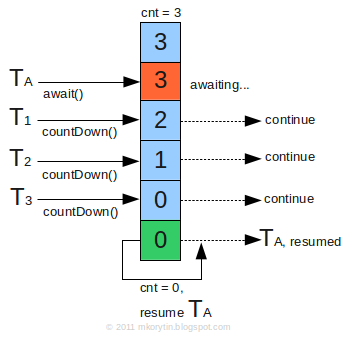

# Java并发编程

### 线程状态转换


##### New

创建后未启动。

##### Runnable

- 正在运行中
- 等待分配时间片

对于操作系统来说包括了就绪状态和执行中状态。

##### Blocked

阻塞状态，可能等待另一个线程的synchronized块释放

##### Waiting

等待其他线程显式唤醒

##### Time Waiting

Java中的Thread.sleep(1)

##### Terminated

死亡：run正常终止或出现异常退出

### 线程停止

编码停止：run正常执行结束，抛异常，状态量

强制停止：thread.stop

中断标志：interrupt（看情况）

### 实现多线程的方式

- 实现Callable接口

- 实现Runnable接口

- 继承Thread类

实现Callable和Runnable接口只能当作一个可以在线程中运行的任务，开启线程还是需要通过Thread调用。

### 基础线程机制

##### Executor

Executor管理多个异步任务的执行，无需程序员手动管理线程的生命周期。

##### 三种Executor

CachedThreadPool：一个任务创建一个线程，无线程数量上限（int），当线程空闲超过规定的时间时会释放。

FixedThreadPool：所有任务使用固定数量的线程

SingleThreadPool：数量为1的FixedThreadPool

ScheduledThreadPool()：定期执行指定任务

```java
public static void main(String[] args) {
    ExecutorService executorService = Executors.newCachedThreadPool();
    for (int i = 0; i < 5; i++) {
        executorService.execute(new MyRunnable());
    }
    executorService.shutdown();
}
```

##### 为什么在JDK1.5引入Executor线程池框架

new Thread()的缺点

- 开销较大
- 以new Thread()方式创建的线程不易于管理，属于野线程，可以无限制创建，相互竞争，造成系统崩溃
- 不利于扩展，比如定期执行、定时执行、线程中断

采用线程池的优点

- 重用已经存在但无用的线程，避免线程创建、销毁时的开销
- 控制最大线程数
- 定期执行、定时执行、单线程、并发控制等

##### 线程内存申请

Java的线程运行是映射到操作系统内核上的，过多创建线程导致

> java.lang.OutOfMemoryError: unable to create new native thread

属于堆外内存，不是JVM运行内存，申请的内存受限于操作系统剩余的可用内存。

想要创建更多线程，可以考虑减小线程栈的大小。

##### yield()

对静态方法Thread.yield()的调用是声明了该线程已经完成了最重要的部分，可以将执行权切换给其他线程，这只是对线程调度器的建议，交给线程优先级相同的线程执行。

##### 线程阻塞

- Thread.sleep()
- wait()等待被唤醒
- io无限期阻塞
- 等待synchroized排他性访问

前两种可以被中断。

### 中断

调用一个线程的interrupt()方法，使该线程抛出一个InterruptedException，从而结束该线程。io阻塞和synchroized对该方法无反应。

```java
public class InterruptExample {
    private static class MyThread1 extends Thread {
        @Override
        public void run() {
            try {
                Thread.sleep(2000);
                System.out.println("Thread run");
            } catch (InterruptedException e) {
                e.printStackTrace();
            }
        }
    }
}
```

```java
public static void main(String[] args) throws InterruptedException {
    Thread thread1 = new MyThread1();
    thread1.start();
    thread1.interrupt();
    System.out.println("Main run");
}
```

> Main run
> java.lang.InterruptedException: sleep interrupted
> at java.lang.Thread.sleep(Native Method)
> at InterruptExample.lambda$main$0(InterruptExample.java:5)
> at InterruptExample$$Lambda$1/713338599.run(Unknown Source)
> at java.lang.Thread.run(Thread.java:745)

##### interrupted()

interrupt()方法无法对一个正常运行的线程中断，不过可以通过使用interrupted()方法获取interrupt方法的调用标记，当interrupt调用后，interrupted()返回true。

```java
public class InterruptExample {
    private static class MyThread2 extends Thread {
        @Override
        public void run() {
            while (!interrupted()) {
                // ..
            }
            System.out.println("Thread end");
        }
    }
}
```

当外部调用interrupt()后循环跳出。

##### Executor的中断

Executor的shutdown()方法调用会在所有线程执行结束后关闭。

shutdownNow()方法相当于调用每个线程的interrupt()方法。

### 互斥同步

Java 提供了两种锁机制来控制多个线程对共享资源的互斥访问，第一个是 JVM 实现的 synchronized，而另一个是 JDK 实现的 ReentrantLock。

##### synchronized

1. 同步一个代码块

```java
public void func() {
    synchronized (this) {
        // ...
    }
}
```

它只作用于同一个对象，如果调用两个对象上的同步代码块，就不会进行同步。

对于以下代码，使用 ExecutorService 执行了两个线程，由于调用的是同一个对象的同步代码块，因此这两个线程会进行同步，当一个线程进入同步语句块时，另一个线程就必须等待。

```java
public class SynchronizedExample {
    public void func1() {
        synchronized (this) {
            for (int i = 0; i < 10; i++) {
                System.out.print(i + " ");
            }
        }
    }
}
```

```java
public static void main(String[] args) {
    SynchronizedExample e1 = new SynchronizedExample();
    ExecutorService executorService = Executors.newCachedThreadPool();
    executorService.execute(() -> e1.func1());
    executorService.execute(() -> e1.func1());
}
```

> 0 1 2 3 4 5 6 7 8 9 0 1 2 3 4 5 6 7 8 9

对于以下代码，两个线程调用了不同对象的同步代码块，因此这两个线程就不需要同步。从输出结果可以看出，两个线程交叉执行。

```java
public static void main(String[] args) {
    SynchronizedExample e1 = new SynchronizedExample();
    SynchronizedExample e2 = new SynchronizedExample();
    ExecutorService executorService = Executors.newCachedThreadPool();
    executorService.execute(() -> e1.func1());
    executorService.execute(() -> e2.func1());
}
```

> 0 0 1 1 2 2 3 3 4 4 5 5 6 6 7 7 8 8 9 9

2. 同步一个方法

```java
public synchronized void func () {
    // ...
}
```

它和同步代码块一样，作用于同一个对象。

3. 同步一个类

```java
public void func() {
    synchronized (SynchronizedExample.class) {
        // ...
    }
}
```

作用于整个类，也就是说两个线程调用同一个类的不同对象上的这种同步语句，也会进行同步。

```java
public class SynchronizedExample {
    public void func2() {
        synchronized (SynchronizedExample.class) {
            for (int i = 0; i < 10; i++) {
                System.out.print(i + " ");
            }
        }
    }
}
```

```java
public static void main(String[] args) {
    SynchronizedExample e1 = new SynchronizedExample();
    SynchronizedExample e2 = new SynchronizedExample();
    ExecutorService executorService = Executors.newCachedThreadPool();
    executorService.execute(() -> e1.func2());
    executorService.execute(() -> e2.func2());
}
```

> 0 1 2 3 4 5 6 7 8 9 0 1 2 3 4 5 6 7 8 9

4. 同步一个静态方法

非静态同步的锁是this

静态同步的锁是字节码对象

##### ReentrantLock

### volatile

volatile是Java的关键词之一，用以声明变量的值随时可能被别的线程修改，使用volatile修饰的变量会强制将修改的值立即写入主存，主存中值的更新会使缓存中的值失效。

非volatile变量的值会被缓存，当线程A修改这个值后，线程B读取这个值可能并不是线程A修改过后的值。

volatile通过在读写操作前后添加内存屏障，**禁止屏障两侧的指令重排序**，保证了变量的有序性。

<详见JMM>

在《Java并发编程的艺术》中有这一段描述：“在多处理器下，为了保证各个处理器的缓存是一致的，就会**实现缓存一致性协议**，每个处理器通过嗅探在总线上传播的数据来检查自己缓存的值是不是过期了，当处理器发现自己缓存行对应的内存地址被修改，就会将当前处理器的缓存行设置成无效状态，当处理器对这个数据进行**修改操作**的时候，会重新从系统内存中把数据读到处理器缓存里。”

volatile通过将“脏数据”立即写回主存，来强制让其他线程里的数据失效，保证了变量的可见性。

##### volatile与Long

该命题的存在是Java内存模型要求lock, unlock, read, load, assign, use, write这个8个操作都具有原子性，但是同时又对64位的数据类型(long&double)给了一个相对宽松的规定，就是允许虚拟机将没有被volatile参数修饰的64位数据类型的读写划分为两次32位的操作来进行，即允许虚拟机将load, store, read, write这个4个操作实现为非原子的。

##### 如何解决非原子性

使用Java提供的原子变量：java.util.concurrent.atomic 包

原子变量原理：

​	底层都被volatile保护

​	利用CAS算法：

  内存值  V（刚开始线程读取的值）

  预估值  A（将要修改时再次读取的值）

  更新值  B（将要改成的值）

  当且仅当 V == A 时， V = B; 否则，不会执行任何操作。

### 线程之间的协作

##### join()

在一个线程中调用另一个线程的join方法，会将当前线程挂起，直到目标线程结束

##### wait() notify() notifyAll()

只能在同步方法或同步块中使用。

wait和notify调用之前必须拿到当前锁对象的monitor，根据monitor判断当前锁的状态，而这种if then结构存在竞态条件，有可能造成wait错过notify。

为什么要释放锁？

wait期间，线程会释放锁，因为需要其他线程获得锁调用同步块中的notify()方法唤醒它，否则会造成死锁。

这也要求wait和notify使用的锁是同一个。

```java
public class Main2 {
    private Object lock = new Object();

    public void run(){
        synchronized (lock) {
            for (int i = 0; i < 10; i++) {
                try {
                    Thread.sleep(1000);
                } catch (InterruptedException e) {
                    e.printStackTrace();
                }
                System.out.println(i);
                if(i == 5){
                    try {
                        lock.wait();
                    } catch (InterruptedException e) {
                        System.out.println("唤醒");
                    }
                }
            }
        }
    }

    public void noti(){
        synchronized (lock) {
            lock.notify();
        }
    }

    public static void main(String[] args) throws InterruptedException {
        Main2 m = new Main2();
        new Thread(()->{
            m.run();
        }).start();
        new Thread(()->{
            try {
                Thread.sleep(8000);
            } catch (InterruptedException e) {
                e.printStackTrace();
            }
            m.noti();
        }).start();

        System.out.println("主线程结束");

    }
}
```


##### await() signal() signalAll()

java.util.concurrent类库中提供的同步机制，通过Lock创建Condition，在Condition上调用await()和signal()使线程等待和唤醒。相比于wait/notify，这种方式可以通过创建多个Condition的方式管理锁，更加灵活。

```java
public class AwaitSignalExample {
    private Lock lock = new ReentrantLock();
    private Condition condition = lock.newCondition();

    public void before() {
        lock.lock();//3
        try {
            System.out.println("before");//4
            condition.signalAll();//5
        } finally {
            lock.unlock();
        }
    }

    public void after() {
        lock.lock();//1
        try {
            condition.await();//释放锁 2
            System.out.println("after");//6
        } catch (InterruptedException e) {
            e.printStackTrace();
        } finally {
            lock.unlock();
        }
    }
}
```

```java
public static void main(String[] args) {
    ExecutorService executorService = Executors.newCachedThreadPool();
    AwaitSignalExample example = new AwaitSignalExample();
    executorService.execute(() -> example.after());
    executorService.execute(() -> example.before());
}
```

> before
> after

### 线程池实现原理

Executor类图：


##### 实现原理

维护corePoolSize与maxPoolSize。corePoolSize为线程池默认大小，即使无线程工作也会维持这个数量。每一个任务分配一个线程，当超过corePoolSize时，新任务进入阻塞队列。如果阻塞队列满了，新任务进入会创建新线程。当线程数量超过maxPoolSize，reject()处理该任务。

FixedThreadPool：使用LinkedBlockingQuene作为阻塞队列，corePoolSize == maxPoolSize，特点时即使没有线程工作也会维护固定数量的线程。

CachedThreadPool：使用SynchronousQueue 作为阻塞队列。

```java
// 使用Executors静态方法进行初始化
ExecutorService service = Executors.newSingleThreadExecutor();
// 常用方法
service.execute(new Thread());
service.submit(new Thread());
service.shutDown();
service.shutDownNow();
```

##### 组成部分

1. 线程池管理器（ThreadPool）：用于创建并管理线程池，包括 创建线程池，销毁线程池，添加新任务； 
2. 工作线程（PoolWorker）：线程池中线程，在没有任务时处于等待状态，可以循环的执行任务； 
3. 任务接口（Task）：每个任务必须实现的接口，以供工作线程调度任务的执行，它主要规定了任务的入口，任务执行完后的收尾工作，任务的执行状态等； 
4. 任务队列（taskQueue）：用于存放没有处理的任务。提供一种缓冲机制。

##### 拒绝策略

AbortPolicy：抛异常

CallerRunsPolicy：由调用线程执行

DiscardPolicy：直接抛弃

DiscardOldestPolicy：抛弃最旧的

##### execute()和submit()

1. execute提交的是Runnable类型的任务，而submit提交的是Callable或者Runnable类型的任务

2. execute的提交没有返回值，而submit的提交会返回一个Future类型的对象

3. execute提交的时候，如果有异常，就会直接抛出异常，而submit在遇到异常的时候，通常不会立马抛出异常，而是会将异常暂时存储起来，等待你调用Future.get()方法的时候，才会抛出异常。如果调用Fulture.get()，主线程会阻塞。

##### 内部实现

```java
public ThreadPoolExecutor(
    int corePoolSize,     // 核心线程数
    int maximumPoolSize,  // 最大线程数
    long keepAliveTime,   // 线程存活时间（在 corePore<*<maxPoolSize 情况下有用）
    TimeUnit unit,        // 存活时间的时间单位
    BlockingQueue<Runnable> workQueue    // 阻塞队列（用来保存等待被执行的任务）
    ThreadFactory threadFactory,    // 线程工厂，主要用来创建线程；
    RejectedExecutionHandler handler // 当拒绝处理任务时的策略
){

this(corePoolSize, maximumPoolSize, keepAliveTime, unit, workQueue,
         Executors.defaultThreadFactory(), defaultHandler);
}
```

##### 线程池的状态

```java
private final AtomicInteger ctl = new AtomicInteger(ctlOf(RUNNING, 0));
```

其中 AtomicInteger 变量 ctl 的功能非常强大：利用低 29 位表示线程池中线程数，通过高 3 位表示线程池的运行状态：

- **RUNNING**：-1 << COUNT_BITS，即高 3 位为 111，该状态的线程池会接收新任务，并处理阻塞队列中的任务；
- **SHUTDOWN**： 0 << COUNT_BITS，即高 3 位为 000，该状态的线程池不会接收新任务，但会处理阻塞队列中的任务；
- **STOP** ： 1 << COUNT_BITS，即高 3 位为 001，该状态的线程不会接收新任务，也不会处理阻塞队列中的任务，而且会中断正在运行的任务；
- **TIDYING** ： 2 << COUNT_BITS，即高 3 位为 010，该状态表示线程池对线程进行整理优化；
- **TERMINATED**： 3 << COUNT_BITS，即高 3 位为 011，该状态表示线程池停止工作；


##### 创建线程池的方式：

Executors.newSingleThreadExecutor();

Executors.newFixedThreadPool(int nThreads);

Executors.newCachedThreadPool();

Execotors.newSingleThreadScheduledExecutor();

Executors.newScheduledThreadPool()

##### 缺陷

```java
public static ExecutorService newCachedThreadPool() {
    return new ThreadPoolExecutor(0, Integer.MAX_VALUE,
                                  60L, TimeUnit.SECONDS,
                                  new SynchronousQueue<Runnable>());
}
```

SynchronousQueue本身不存储元素，新进任务就阻塞等待消费。

实现效果是，线程池都是用工作线程池外的线程执行任务，（即只使用maxPoolSize作为判断条件），直到到达最大线程数Integer.MAX_VALUE，之前OOM。

cache：60L


```java
public static ScheduledExecutorService newScheduledThreadPool(int corePoolSize) {
  return new ScheduledThreadPoolExecutor(corePoolSize);
}
public ScheduledThreadPoolExecutor( int corePoolSize) {
  super(corePoolSize, Integer.MAX_VALUE, 0, NANOSECONDS,
     new DelayedWorkQueue());
}
```

同样，线程池都是用工作线程池外的线程执行任务，（即只使用maxPoolSize作为判断条件），直到到达最大线程数Integer.MAX_VALUE，之前OOM。


```java
public static ExecutorService newSingleThreadExecutor() {
    return new FinalizableDelegatedExecutorService
        (new ThreadPoolExecutor(1, 1,
                                0L, TimeUnit.MILLISECONDS,
                                new LinkedBlockingQueue<Runnable>()));
}
```

相当于单线程执行，但LinkedBlockingQueue不设置size，导致都阻塞不拒绝OOM。


```java
public static ExecutorService newFixedThreadPool(int nThreads) {
    return new ThreadPoolExecutor(nThreads, nThreads,
                                  0L, TimeUnit.MILLISECONDS,
                                  new LinkedBlockingQueue<Runnable>());
}
```

同样，阻塞队列OOM。

```java
        //corePoolSize=maxPoolSize不开工作线程，只使用核心线程与阻塞队列配合，溢出则丢弃
        return new ThreadPoolExecutor(16, 16, 0, TimeUnit.MINUTES, new LinkedBlockingQueue<>(20),new ThreadPoolExecutor.DiscardPolicy());
```

##### Eg.

```java
	public static void main(String[] args) {
        Vector<Integer> list = new Vector<>();

        ExecutorService executorService = Executors.newFixedThreadPool(10);
        ThreadPoolExecutor executorService2 = new ThreadPoolExecutor(4, 11,
                1000L, TimeUnit.MILLISECONDS,
                new LinkedBlockingQueue<Runnable>());
        executorService2.allowCoreThreadTimeOut(true);
        List<Future<Boolean>> futures = new ArrayList<>();

        for(int i=0;i<10;i++){
            int a = i;
            Future<Boolean> future = executorService2.submit(() ->{
                System.out.println(a  + "执行");
                list.add(a);
                Thread.sleep(3000);
                return true;
            });
            futures.add(future);
        }

        try {
            for(Future<Boolean> future:futures){
                if(!future.get()){
                    System.out.println("报错");
                }
            }
        } catch (Exception e) {
            System.out.println("报错");
            e.printStackTrace();
        }

        System.out.println(list);
//        executorService.shutdown();
    }
```

### synchronized底层原理

对象被创建在堆中，对象在内存中的布局可以分为三个区域：对象头，实例数据，对齐填充。

对象头中包括运行时的数据（Mark Word）：锁状态标志、线程持有的锁、对象年龄等。

（见Java对象内存布局.md）


##### 宏观实现

1. 先在JDK6 以前，synchronized 那时还属于重量级锁，每次加锁都依赖操作系统Mutex Lock实现，涉及到操作系统让线程从用户态切换到内核态，切换成本很高；
2. 到了JDK6，研究人员引入了偏向锁和轻量级锁，因为Sun 程序员发现大部分程序大多数时间都不会发生多个线程同时访问竞态资源的情况，每次线程都加锁解锁，每次这么搞都要操作系统在用户态和内核态之前来回切，太耗性能了。

<请查看 对象内存布局.md>

```C++
ObjectMonitor() {
    _header       = NULL;
    _count        = 0;   // 重入次数
    _waiters      = 0,   // 等待线程数
    _recursions   = 0;
    _object       = NULL;
    _owner        = NULL;  // 当前持有锁的线程
    _WaitSet      = NULL;  // 调用了 wait 方法的线程被阻塞 放置在这里
    _WaitSetLock  = 0 ;
    _Responsible  = NULL ;
    _succ         = NULL ;
    _cxq          = NULL ;
    FreeNext      = NULL ;
    _EntryList    = NULL ; // 等待锁 处于block的线程 有资格成为候选资源的线程
    _SpinFreq     = 0 ;
    _SpinClock    = 0 ;
    OwnerIsThread = 0 ;
  }
```

每一个实例都有一个Monitor对象，由C++实现，其中定义了—WaitSet、—EntryList,其中Waitset保存了等待锁的线程对象，—owner指向当前持有锁的线程，

加锁：—waitset移出、—owner指向、—count+1

- 所有请求锁的线程首先被放在ContentionList这个竞争队列中;
- Contention List 中那些有资格成为候选资源的线程被移动到 Entry List 中;
- 任意时刻，最多只有一个线程正在竞争锁资源，该线程被成为 OnDeck;
- 当前已经获取到所资源的线程被称为 Owner;
- 处于 ContentionList、EntryList、WaitSet 中的线程都处于阻塞状态，该阻塞是由操作系统来完成的(Linux 内核下采用 `pthread_mutex_lock` 内核函数实现的);

非公平：

- Synchronized 在线程竞争锁时，首先做的不是直接进ContentionList 队列排队，而是尝试自旋获取锁（可能ContentionList 有别的线程在等锁），如果获取不到才进入 ContentionList，这明显对于已经进入队列的线程是不公平的；
- 另一个不公平的是自旋获取锁的线程还可能直接抢占 OnDeck 线程的锁资源。

ObjectMonitor中有两个队列_WaitSet和_EntryList，用来保存ObjectWaiter对象列表(每个等待锁的线程都会被封装ObjectWaiter对象)，_owner指向持有ObjectMonitor对象的线程，当多个线程同时访问一段同步代码时，首先会进入_EntryList 集合，当线程获取到对象的monitor 后进入 _Owner 区域并把monitor中的owner变量设置为当前线程同时monitor中的计数器count加1，若线程调用 wait() 方法，将释放当前持有的monitor，owner变量恢复为null，count自减1，同时该线程进入 WaitSe t集合中等待被唤醒。若当前线程执行完毕也将释放monitor(锁)并复位变量的值，以便其他线程进入获取monitor(锁)。  monitor对象存在于每个Java对象的对象头中(存储的指针的指向)，synchronized锁便是通过这种方式获取锁的，也是为什么Java中任意对象可以作为锁的原因，同时也是notify/notifyAll/wait等方法存在于顶级对象Object中的原因(关于这点稍后还会进行分析)


##### 锁升级


##### 偏向锁

偏向锁的思想是偏向于让第一个获取锁对象的线程，这个线程在之后获取该锁就不再需要进行同步操作，甚至连 CAS 操作也不再需要。

当锁对象第一次被线程获得的时候，进入偏向状态，标记为 1 01。同时使用 CAS 操作将线程 ID 记录到 Mark Word 中，如果 CAS 操作成功，这个线程以后每次进入这个锁相关的同步块就不需要再进行任何同步操作。

当有另外一个线程去尝试获取这个锁对象时，偏向状态就宣告结束，此时撤销偏向（Revoke Bias）后恢复到未锁定状态或者轻量级锁状态。

##### 轻量级锁

下图左侧是一个线程的虚拟机栈，其中有一部分称为 Lock Record 的区域，这是在轻量级锁运行过程创建的，用于存放锁对象的 Mark Word。而右侧就是一个锁对象，包含了 Mark Word 和其它信息。


轻量级锁是相对于传统的重量级锁而言，它使用 CAS 操作来避免重量级锁使用互斥量的开销。对于绝大部分的锁，在整个同步周期内都是不存在竞争的，因此也就不需要都使用互斥量进行同步，可以先采用 CAS 操作进行同步，如果 CAS 失败了再改用互斥量进行同步。

当尝试获取一个锁对象时，如果锁对象标记为 0 01，说明锁对象的锁未锁定（unlocked）状态。此时虚拟机在当前线程栈中创建 Lock Record，然后使用 CAS 操作将对象的 Mark Word 更新为 Lock Record 指针。如果 CAS 操作成功了，那么线程就获取了该对象上的锁，并且对象的 Mark Word 的锁标记变为 00，表示该对象处于轻量级锁状态。


如果 CAS 操作失败了，虚拟机首先会检查对象的 Mark Word 是否指向当前线程的虚拟机栈，如果是的话说明当前线程已经拥有了这个锁对象，那就可以直接进入同步块继续执行，否则说明这个锁对象已经被其他线程线程抢占了。

当锁升级为轻量级锁之后，如果依然有新线程过来竞争锁，首先新线程会自旋尝试获取锁，尝试到一定次数（默认10次）依然没有拿到，锁就会升级成重量级锁。

### Lock实现原理

ReentrantLock是一个可重入的互斥锁，又称为独占锁。

ReentrantLock通过自定义队列同步器（AQS-AbstractQueueSynchronized是实现锁的关键。）来实现锁的释放和获取。

独占：就是在同一时刻只能有一个线程获取到锁，而其他线程只能处于同步队列中等待，只有获取锁的线程释放了锁，后续的线程才能获得锁。

可重入：就是支持重进入的锁，它表示该锁能够支持一个线程对资源重复加锁。

该锁支持公平性和非公平性选择。

**synchronized 原始采用的是 CPU 悲观锁机制**，即线程获得的是独占锁。独占锁意味着其他线程只能依靠阻塞来等待线程释放锁。**Lock 用的是乐观锁方式**。所谓乐观锁就是，每次不加锁而是假设没有冲突而去完成某项操作，如果因为冲突失败就重试，直到成功为止。乐观锁实现的机制就是 CAS 操作（Compare and Swap）。

ReentrantLock的基本实现可以概括为：先通过CAS尝试获取锁。如果此时已经有线程占据了锁，那就加入AQS队列并且被挂起。当锁被释放之后，排在CLH队列队首的线程会被唤醒，然后CAS再次尝试获取锁。在这个时候，如果：

非公平锁：如果同时还有另一个线程进来尝试获取，那么有可能会让这个线程抢先获取；

公平锁：如果同时还有另一个线程进来尝试获取，当它发现自己不是在队首的话，就会排到队尾，由队首的线程获取到锁。

在ReentrantLock的默认构造函数中，初始化了一个AQS

```java
	private final Sync sync; 	
	/**
     * Creates an instance of {@code ReentrantLock}.
     * This is equivalent to using {@code ReentrantLock(false)}.
     */
    public ReentrantLock() {
        sync = new NonfairSync();
    }
	abstract static class Sync extends AbstractQueuedSynchronizer{...}
```

##### AbstractQueuedSynchronizer的内部结构：


```java
static final class Node {
        volatile int waitStatus;

        volatile Node prev;

        volatile Node next;

        volatile Thread thread;

        Node nextWaiter;
```

##### lock.lock()怎么获取锁

```java
	public void lock() {
        sync.lock();
    }
```

```java
	static final class NonfairSync extends Sync {

        final void lock() {
            if (compareAndSetState(0, 1))//如果两个线程同时来，那么只有一个能交换成功
                setExclusiveOwnerThread(Thread.currentThread());
            else
                acquire(1);
        }
```

lock的基本操作是通过CAS实现的。

```java
	public final void acquire(int arg) {
        if (!tryAcquire(arg) &&
            acquireQueued(addWaiter(Node.EXCLUSIVE), arg))
            selfInterrupt();
    }
```

如果没有获得到锁，

tryAcquire：尝试再获取一次锁**（公平锁与非公平锁的区别就是，该方法中不公平锁的实现不关注当前节点是都有前驱节点）**

addWaiter：将当前线程加入到双向链表中

acquireQueued：通过自旋，判断当前队列节点是都可以获取锁


##### 自旋锁

```java
	private Node enq(final Node node) {
        for (;;) {
            Node t = tail;
            if (t == null) { // Must initialize
                if (compareAndSetHead(new Node()))
                    tail = head;
            } else {
                node.prev = t;
                if (compareAndSetTail(t, node)) {
                    t.next = node;
                    return t;
                }
            }
        }
    }
```

##### unlock()

```java
public void unlock() {
    sync.release(1);
}
```

AQS中的release：
```java
public final boolean release(int arg) {
    if (tryRelease(arg)) {
        Node h = head;
        if (h != null && h.waitStatus != 0)
            unparkSuccessor(h);
        return true;
    }
    return false;
}
```

ReentrantLock的Sync对tryRelease的实现：

```java
protected final boolean tryRelease(int releases) {
    int c = getState() - releases;
    if (Thread.currentThread() != getExclusiveOwnerThread())
        throw new IllegalMonitorStateException();
    boolean free = false;
    if (c == 0) {
        free = true;
        setExclusiveOwnerThread(null);
    }
    setState(c);
    return free;
}
```

释放锁就是对AQS中的状态值State进行修改。同时更新下一个链表中的线程等待节点。

### JUC其他组件

##### CountdownLatch

利用它可以实现类似计数器的功能。比如有一个任务 A，它要等待其他 4 个任务执行完毕之后才能执行，此时就可以利用 CountDownLatch 来实现这种功能了。

维护了一个计数器 cnt，每次调用 countDown() 方法会让计数器的值减 1，减到 0 的时候，那些因为调用 await() 方法而在等待的线程就会被唤醒。



CountdownLatch只提供了一个构造器：

```java
public CountDownLatch(int count) {...};  // 参数count为计数值
```

```java
//调用await()方法的线程会被挂起，它会等待直到count值为0才继续执行
public void await() throws InterruptedException { };
//和await()类似，只不过等待一定的时间后count值还没变为0的话就会继续执行
public boolean await(long timeout, TimeUnit unit) throws InterruptedException { };
//将count值减1
public void countDown() { };
```

##### CyclicBarrier

控制多个线程相互等待，只有线程到达一定数量后，才会一起向后执行。

CyclicBarrier的计数器是递增的。


##### Semaphore

信号量，通常用于对资源访问线程数的控制，通过 acquire() 获取一个许可，如果没有就等待， release() 释放一个许可。


构造器：

```java
public Semaphore(int permits) {          
    //参数permits表示许可数目，即同时可以允许多少线程进行访问
    sync = new NonfairSync(permits);
}

public Semaphore(int permits, boolean fair) {    
    //这个多了一个参数fair表示是否是公平的，即等待时间越久的越先获取许可    
    sync = (fair) ? new FairSync(permits) : new NonfairSync(permits);
}
```

acquire和release都可能被阻塞，如果想要不被阻塞可使用boolean tryAcquire()等

### JMM


##### 原子性

Java内存模型保证了read、load、use、assign、store、write、lock、unlock这八个操作具有原子性，但允许虚拟机将没有被volatile修饰的long、duuble类型的变量的读写操作划分为两次32位操作，即read、load、store、write可以不具有原子性。

尽管这些操作本身具有原子性，但通常是发生一系列操作，作为整体，不具有原子性，这也是线程不安全的主要原因。


AtomicInteger 能保证多个线程修改的原子性。


##### 可见性

实现可见性的方式：

- volatile

- synchronized（对一个变量进行unlock操作之前，必须把变量值同步回主存）

- final 被 final 关键字修饰的字段在构造器中一旦初始化完成，并且没有发生 this 逃逸（其它线程通过 this 引用访问到初始化了一半的对象），那么其它线程就能看见 final 字段的值。

##### 有序性

在本线程内观察，所有操作都是有序的。在一个线程内观察另一线程，所有操作都是无序的，无序是因为发生了指令重排序。

### 锁优化

##### 自旋锁

对于互斥锁，如果资源已经被占用，资源申请者只能进入睡眠状态。但是自旋锁不会引起调用者睡眠，如果自旋锁已经被别的执行单元保持，调用者就一直循环在那里看是否该自旋锁的保持者已经释放了锁。

互斥同步的进入阻塞状态的开销都很大，应该尽量避免。在许多应用中，共享数据的锁定状态只会持续很短的一段时间。自旋锁的思想是让一个线程在请求一个共享数据的锁时执行忙循环（自旋）一段时间，如果在这段时间内能获得锁，就可以避免进入阻塞状态。

自旋锁虽然能避免进入阻塞状态从而减少开销，但是它需要进行忙循环操作占用 CPU 时间，它只适用于共享数据的锁定状态很短的场景。

##### 锁消除

对于一些不可能存在竞争的共享数据的锁进行消除。

主要通过逃逸分析来实现：如果堆中的数据不可能逃逸出去被其他线程访问到，那么就可以将它们当成私有数据来对待，将它们的锁消除。

##### 锁粗化

如果虚拟机检测到一系列的操作都是对同一个对象反复加锁和解锁，那么会把锁的范围扩大到一系列操作的外面。

##### 轻量级锁

JDK1.6引入轻量级锁，让锁拥有四个状态，无锁unlocked、偏向锁biasable、轻量级锁lightweight locked、重量级锁inflated，在MarkWord中标记。


对于绝大部分锁，在整个同步周期内都是不存在竞争的，因此不需要都使用互斥量进行同步，可以先采用CAS操作进行同步，如果CAS失败了再采用互斥量。

当尝试获取一个对象的锁时，如果锁对象标记处于01状态，此时虚拟机在当前线程中创建Lock Record，然后使用CAS操作将对象的Markword更新为Lock Word指针。如果CAS操作成功，那么当前线程就会获取该对象上的锁，并且对象的Mark Word更新为01.

如果CAS失败，首先检查该对象的Mark Word是否指向当前线程的虚拟机栈，如果是，说明当前线程已经持有该对象的锁了，继续执行同步中的内容。否则说明该对象的锁被其他线程抢占，且轻量级锁不再有效，膨胀为重量级锁。

##### 偏向锁

当第一个线程获取到锁对象后，再获取该锁就不需要进行同步操作，甚至不需要CAS操作。

当其他线程尝试获取锁时，偏向状态失效，恢复到未锁定状态或轻量级锁状态。

### AtomicInteger

使用unsafe的cas与自旋实现

### UnSafe类

上述compareAndSetState等CAS操作全部是基于unsafe的本地CAS方法。

由硬件保证原子性，平台相关。

unsafe类不是提供给用户程序调用的类（Unsafe.getUnsafe()的代码里限制了只有启动类加载器(bootstrap classloader)加载的Class才能访问它）。因此如果不采用反射手段，只能通过其他的JavaAPI来间接使用它，如J.U.C里面的整数原子类，其中compareAndSet()和getAndIncrement()等方法都使用了Unsafe类的CAS操作。

### *单例模式双重校验锁为什么要加volatile

```java
public class Singleton {  
    private volatile static Singleton singleton;  
    private Singleton (){}  
    public static Singleton getSingleton() {  
    if (singleton == null) {  
        synchronized (Singleton.class) {  
        if (singleton == null) {  
            singleton = new Singleton();  
        }  
        }  
    }  
    return singleton;  
    }  
}
```

在singleton = new Singleton();发生指令重排序，原本

1、开辟内存空间 2、初始化 3、指向引用

23步骤互换，导致另一个线程在指向引用后单例！=null，但还未初始化，得到的是不完整的对象。

### 协程

协程运行在线程之上，当一个协程执行完成后，可以选择主动让出，让另一个协程运行在当前线程之上。**协程并没有增加线程数量，只是在线程的基础之上通过分时复用的方式运行多个协程**，而且协程的切换在用户态完成，切换的代价比线程从用户态到内核态的代价小很多。

实际上协程并不是什么银弹，协程只有在等待IO的过程中才能重复利用线程，上面我们已经讲过了，线程在等待IO的过程中会陷入阻塞状态，意识到问题没有？

假设协程运行在线程之上，并且协程调用了一个阻塞IO操作，这时候会发生什么？实际上操作系统并不知道协程的存在，它只知道线程，**因此在协程调用阻塞IO操作的时候，操作系统会让线程进入阻塞状态，当前的协程和其它绑定在该线程之上的协程都会陷入阻塞而得不到调度，这往往是不能接受的。**

因此在协程中不能调用导致线程阻塞的操作。也就是说，协程只有和异步IO结合起来，才能发挥最大的威力。

而对于计算密集型任务，多线程本身就不能提供更多的性能，所以协程的作用也十分有限。

### 进程间通信

管道pipe：管道是一种半双工的通信方式，数据只能单向流动，而且只能在具有亲缘关系的进程间使用。进程的亲缘关系通常是指父子进程关系。

命名管道FIFO：有名管道也是半双工的通信方式，但是它允许无亲缘关系进程间的通信。

消息队列MessageQueue：消息队列是由消息的链表，存放在内核中并由消息队列标识符标识。消息队列克服了信号传递信息少、管道只能承载无格式字节流以及缓冲区大小受限等缺点。

共享存储SharedMemory：共享内存就是映射一段能被其他进程所访问的内存，这段共享内存由一个进程创建，但多个进程都可以访问。共享内存是最快的 IPC 方式，它是针对其他进程间通信方式运行效率低而专门设计的。它往往与其他通信机制，如信号量，配合使用，来实现进程间的同步和通信。

信号量Semaphore：信号量是一个计数器，可以用来控制多个进程对共享资源的访问。它常作为一种锁机制，防止某进程正在访问共享资源时，其他进程也访问该资源。因此，主要作为进程间以及同一进程内不同线程之间的同步手段。

套接字Socket：套解口也是一种进程间通信机制，与其他通信机制不同的是，它可用于不同及其间的进程通信。

信号 ( sinal ) ： 信号是一种比较复杂的通信方式，用于通知接收进程某个事件已经发生。

https://blog.csdn.net/zhaohong_bo/article/details/89552188

### ThreadLocal

##### 原理

每一个**Thread**内部维护了一个map，类型为**ThreadLocal**的静态内部类ThreadLocalMap，key为ThreadLocal，value为value。

```java
public T get() {
  Thread t = Thread.currentThread();
  ThreadLocalMap map = getMap(t);
  if (map != null) {
    ThreadLocalMap.Entry e = map.getEntry(this);
    if (e != null) {
      @SuppressWarnings("unchecked")
      T result = (T)e.value;
      return result;
    }
  }
  return setInitialValue();
}
ThreadLocalMap getMap(Thread t) {
  return t.threadLocals;
}
```

最终的变量是放在了**当前线程**的 `ThreadLocalMap` 中，并不是存在 ThreadLocal 上，ThreadLocal 可以理解为只是ThreadLocalMap的封装，传递了变量值。

##### ThreadLocalMap

Entry[] 使用开放定址法解决hash冲突（如果位置i已经存在元素，那么继续向i+1寻找空位。也造成查询的时候如果位置i不是该key，还需要继续向数组后面搜索）

大概是这样的：

```伪
Thread1{
	ThreadLocalMap<ThreadLocal<T>,T> threadLocalMapT1:{
		threadLocal1<Integer> :1
		threadLocals<String> : "str"
	}
}

ThreadLocal<Integer> threadLocal1;
Thread1 main{
 threadLocal1.set(2);//结果：threadLocal1<Integer> :2
 threadLocal1.get()//this.Thread.threadLocalMapT1.get(threadLocal1)
}
```

##### 内存泄漏问题

ThreadLocalMap：

key为当前ThreadLocal类型的弱引用，每次垃圾回收如果无其他强引用就会被回收。

value为强引用。

这样一来就会出现 key 为 null 的 value。

ThreadLocalMap实现中已经考虑了这种情况，在调用 set()、get()、remove() 方法的时候，会清理掉 key 为 null 的记录。如果说会出现内存泄漏，那只有在出现了 key 为 null 的记录后，没有手动调用 remove() 方法，并且之后也不再调用 get()、set()、remove() 方法的情况下。

ThreadLocal的设计者考虑到线程往往生命周期很长，比如经常会用到线程池，线程一直存活着，根据JVM **根搜索算法**，一直存在 Thread -> ThreadLocalMap -> Entry（元素）这样一条引用链路, 如下图，如果key不设计成WeakReference类型，是强引用的话，就一直不会被GC回收，key就一直不会是null，不为null Entry元素就不会被清理（ThreadLocalMap是根据key是否为null来判断是否清理Entry），达到的效果就是只要ThreadLocal 所在的作用域结束了工作被清理了，GC回收的时候就会把key引用对象回收，key置为null，ThreadLocal会尽力保证Entry清理掉来最大可能避免内存泄漏。


《深入理解Java虚拟机》