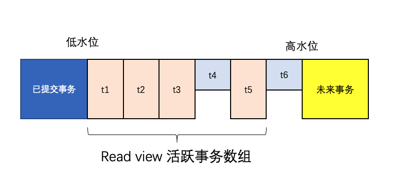
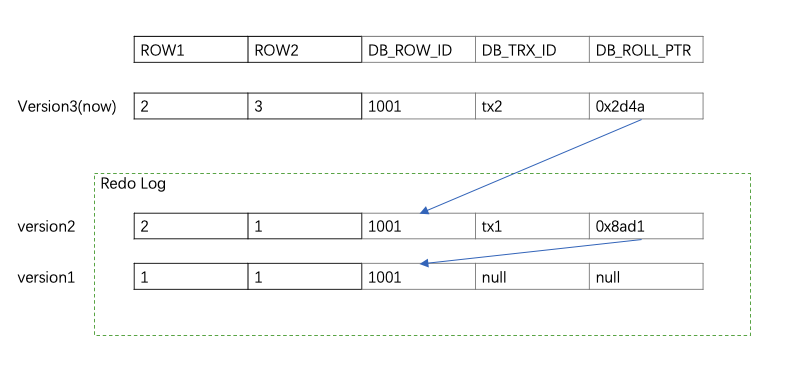

# MVCC

- **应对高并发事务, MVCC比单纯的加行锁更有效, 开销更小**;

### Read View

当我们某个事务执行快照读的时候，对该记录创建一个Read View读视图，把它比作条件用来判断当前事务能够看到哪个版本的数据，既可能是当前最新的数据，也有可能是该行记录的undo log里面的某个版本的数据。

Read View遵循一个可见性算法，主要是将要被修改的数据的最新记录中的DB_TRX_ID（即当前事务ID）取出来，与系统当前其他活跃事务的ID去对比（由Read View维护），如果DB_TRX_ID跟Read View的属性做了某些比较，不符合可见性，那就通过DB_ROLL_PTR回滚指针去取出Undo Log中的DB_TRX_ID再比较，即遍历链表的DB_TRX_ID（从链首到链尾，即从最近的一次修改查起），直到找到满足特定条件的DB_TRX_ID, 那么这个DB_TRX_ID所在的旧记录就是当前事务能看见的最新老版本

##### 当前读：

像select lock in share mode(共享锁), select for update ; update, insert ,delete(排他锁)这些操作都是一种当前读，为什么叫当前读？就是它读取的是记录的最新版本，读取时还要保证其他并发事务不能修改当前记录，会对读取的记录进行加锁。

快照读：

不加锁的select

### 隔离级别

RR，RC生效

##### RR

在RR级别下的某个事务的对某条记录的第一次快照读会创建一个快照及Read View, 将当前系统活跃的其他事务记录起来，此后在调用快照读的时候，还是使用的是同一个Read View，所以只要当前事务在其他事务提交更新之前使用过快照读，那么之后的快照读使用的都是同一个Read View，所以对之后的修改不可见；（见后文）

一个事务使用一个快照

##### RC

每次快照读都会新生成一个快照和Read View

##### 版本可见性：

InnoDB 为每个事务构造了一个数组，用来保存这个事务启动瞬间，当前正在“活跃”的所有事务 ID。“活跃”指的就是，启动了但还没提交。

**数组里面**事务 ID 的最小值记为低水位，当前**系统里面已经创建过**的事务 ID 的最大值加 1 记为高水位。

这个视图数组和高水位，就组成了当前事务的一致性视图（read-view）。

而数据版本的可见性规则，就是基于数据的 row trx_id 和这个一致性视图的对比结果得到的。

如图，t1, t2, t4, t5已提交，t4，t6未提交。

由[t1, t2, t4, t5]组成的事务id数组与高水位t6组成read view。

这样，对于当前事务的启动瞬间来说，一个数据版本的 row trx_id，有以下几种可能：

- 如果落在蓝色部分，表示这个版本是已提交的事务或者是当前事务自己生成的，这个数据是可见的；
- 如果落在黄色部分，表示这个版本是由将来启动的事务生成的，是肯定不可见的；
- 如果落在高低水位之间，那就包括两种情况
  - a. 若 row trx_id 在数组中（t1等），表示这个版本是由还没提交的事务生成的，不可见；
  - b. 若 row trx_id 不在数组中（t4等），表示这个版本是已经提交了的事务生成的，可见。

### 实现

6字节的事务ID(`DB_TRX_ID`)字段: 标记了最新更新这条行记录的transaction id，每处理一个事务，其值自动+1
另外，删除在内部被视为一个更新，其中行中的特殊位被设置为将其标记为已删除

7字节的回滚指针(`DB_ROLL_PTR`)字段 : 指向当前记录项的rollback segment的 `undo log`(撤销日志记录), 找之前版本的数据就是通过这个指针。

6字节的`DB_ROW_ID`字段: 当由innodb自动产生聚集索引时，聚集索引包括这个DB_ROW_ID的值，否则聚集索引中不包括这个值，这个用于索引当中。

eg.

| Tx0001                             | 结果                       | Tx0002 | 结果 |
| ---------------------------------- | ------ | ---- | ---------------------------------- |
| start transaction; |  |  | |
|  |  | start transaction; | |
| select * from t_test where id = 1; | (1,"a",10) |  |  |
|                                   |                                   | select * from t_test where id = 1; | (1,"a",10) |
| update t_test set age = age + 1 where id = 1; | Query OK, 1 row affected |        |      |
| select * from t_test where id = 1; | (1,"a",11) |  |      |
| | | update t_test set age = age + 1 where id = 1; | (阻塞) |
| commit; | | | Query OK, 1 row affected |
| | | select * from t_test where id = 1; | (1,"a",12) |
| | | commit; | |

https://juejin.cn/post/6844903543992926221

https://www.jianshu.com/p/8845ddca3b23

https://time.geekbang.org/column/article/70562