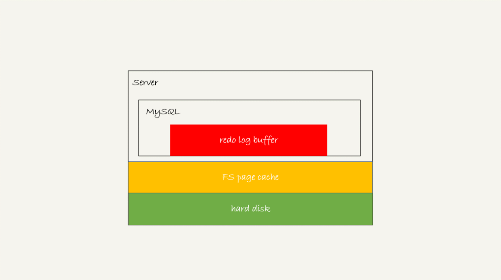

# MySQL保证数据不丢

https://time.geekbang.org/column/article/76161

只要 redo log 和 binlog 保证持久化到磁盘，就能确保 MySQL 异常重启后，数据可以恢复。

如何保证redo log 和 binlog 持久化到磁盘？

### binlog的写入机制

事务执行过程中，写入到binlog cache。

事务提交，binlog cache写入到binlog文件。

一个事务的binlog不能被拆开（binlog cache原子性），binlog cache过大（binlog_cache_size）则写入磁盘。每个线程占用单独的binlog cache，但公用binlog文件。

其中，binlog cache写入file分为两部分：

- write操作，指写入到文件系统的page cache，并没有持久化到磁盘，速度较快。
- fsync操作，持久化到磁盘，占用IOPS，性能瓶颈。

fsync时机：

1. sync_binlog=0 的时候，表示每次提交事务都只 write，不 fsync；

2. sync_binlog=1 的时候，表示每次提交事务都会执行 fsync；

3. sync_binlog=N(N>1) 的时候，表示每次提交事务都 write，但累积 N 个事务后才 fsync。（宕机丢失n个事务）

### redo log的写入机制

innodb_flush_log_at_trx_commit：

1. 设置为 0 的时候，表示每次事务提交时都只是把 redo log 留在 redo log buffer 中 ;
2. 设置为 1 的时候，表示每次事务提交时都将 redo log 直接持久化到磁盘；
3. 设置为 2 的时候，表示每次事务提交时都只是把 redo log 写到 page cache。

InnoDB 有一个后台线程，每隔 1 秒，就会把 redo log buffer 中的日志，调用 write 写到文件系统的 page cache，然后调用 fsync 持久化到磁盘。

如果把 innodb_flush_log_at_trx_commit 设置成 1，那么 redo log 在 prepare 阶段就要持久化一次，因为有一个崩溃恢复逻辑是要依赖于 prepare 的 redo log，再加上 binlog 来恢复的。由于有后台每秒一次的page cache持久化操作，InnoDB认为redo log的commit操作不需要fsync操作，只write操作就够了。（如果掉电，根据崩溃恢复逻辑redolog的prepare与binlog是完整的，即使丢失在1秒内page cache里的redolog commit操作不会影响事务提交）

通常我们说 MySQL 的“双 1”配置，指的就是 sync_binlog 和 innodb_flush_log_at_trx_commit 都设置成 1。也就是说，一个事务完整提交前，需要等待两次刷盘，一次是 redo log（prepare 阶段），一次是 binlog。

### 组提交

日志逻辑序列号（log sequence number，LSN）的概念。LSN 是单调递增的，用来对应 redo log 的一个个写入点。每次写入长度为 length 的 redo log， LSN 的值就会加上 length。

是三个并发事务 (trx1, trx2, trx3) 在 prepare 阶段，都写完 redo log buffer，持久化到磁盘的过程，对应的 LSN 分别是 50、120 和 160。

trx1 是第一个到达的，会被选为这组的 leader；

等 trx1 要开始写盘的时候，这个组里面已经有了三个事务，这时候 LSN 也变成了 160；

trx1 去写盘的时候，带的就是 LSN=160，因此等 trx1 返回时，所有 LSN 小于等于 160 的 redo log，都已经被持久化到磁盘；

这时候 trx2 和 trx3 就可以直接返回了。

一次组提交里面，组员越多，节约磁盘 IOPS 的效果越好。

所以，一次组提交里面，组员越多，节约磁盘 IOPS 的效果越好。但如果只有单线程压测，那就只能老老实实地一个事务对应一次持久化操作了。

在并发更新场景下，第一个事务写完 redo log buffer 以后，接下来这个 fsync 越晚调用，组员可能越多，节约 IOPS 的效果就越好。为了让一次 fsync 带的组员更多，MySQL 有一个很有趣的优化：拖时间。

binlog组提交：

这么一来，binlog 也可以组提交了。在执行图 5 中第 4 步把 binlog fsync 到磁盘时，如果有多个事务的 binlog 已经写完了，也是一起持久化的，这样也可以减少 IOPS 的消耗。

binlog_group_commit_sync_delay 参数，表示延迟多少微秒后才调用 fsync;binlog_group_commit_sync_no_delay_count 参数，表示累积多少次以后才调用 fsync。

##### 如果你的 MySQL 现在出现了性能瓶颈，而且瓶颈在 IO 上，可以通过哪些方法来提升性能呢？

针对这个问题，可以考虑以下三种方法：设置 binlog_group_commit_sync_delay 和 binlog_group_commit_sync_no_delay_count 参数，减少 binlog 的写盘次数。这个方法是基于“额外的故意等待”来实现的，因此可能会增加语句的响应时间，但没有丢失数据的风险。

将 sync_binlog 设置为大于 1 的值（比较常见是 100~1000）。这样做的风险是，主机掉电时会丢 binlog 日志。

将 innodb_flush_log_at_trx_commit 设置为 2。这样做的风险是，主机掉电的时候会丢数据。

### 什么情况下会手动改到非双1配置？

1. 业务高峰期，有预知的高峰期，DBA会有预案，降低数据库压力。
2. 备库延迟，为了让备库尽快赶上主库。
3. 用备库恢复主库的副本，应用binlog的过程。、
4. 批量导入数据。

一般情况下，把生产库改成“非双 1”配置，是设置 innodb_flush_logs_at_trx_commit=2、sync_binlog=1000。