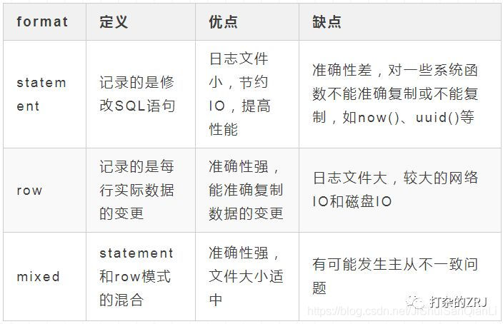

# MySQL日志

## redo log（重做日志）

物理日志

属于InnoDB存储引擎日志

如果每一次的更新操作都需要写进磁盘，然后磁盘也要找到对应的那条记录，然后再更新，IO成本太高，效率低的难以忍受。

解决策略是WAL先写日志再写磁盘，等到系统空闲时，或日志文件写满，再同步到磁盘上。（顺序写，分组提交）

MySQL 在更新数据时，为了减少磁盘的随机 IO，因此并不会直接更新磁盘上的数据，而是先更新 Buffer Pool 中缓存页的数据，等到合适的时间点，再将这个缓存页持久化到磁盘。而 Buffer Pool 中所有缓存页都是处于内存当中的，当 MySQL 宕机或者机器断电，内存中的数据就会丢失，因此 MySQL 为了防止缓存页中的数据在更新后出现数据丢失的现象，引入了 redo log 机制。

redo log的大小是固定的，可以配置四个文件（配置），每个文件1G（配置），循环写每个文件。

write pos 是当前记录的位置，一边写一边后移，写到第 3 号文件末尾后就回到 0 号文件开头。checkpoint 是当前要擦除的位置，也是往后推移并且循环的，擦除记录前要把记录更新到数据文件。

write pos 和 checkpoint 之间的是可写部分，可以用来记录新的操作。如果 write pos 追上 checkpoint，表示“粉板”满了，这时候不能再执行新的更新，得停下来先擦掉一些记录，把 checkpoint 推进一下。

- WAL(日志预写)
  称为Write-Ahead-Log，对数据的变更，先写操作日志，然后再更新数据，需要保证在数据更新前，你的操作日志一定要先写到磁盘上，mysql、postgresql、zookeeper对数据的变更都应用了wal
- Redo log三种不同程度的刷新方式

1. innodb_flush_log_at_trx_commit = 1
   每次事物提交，执行flush buffer+write+fsync,把脏页数据，刷新至redo log的buffer,并写入redo log，在同步至磁盘，保证落地到redo log文件，mysql默认的刷新方式，最安全的一种方式，即使宕机也不会丢失事物，mysql主库，一般都是该方式
2. innodb_flush_log_at_trx_commit = 2
   每次事物提交，执行flush buffer+write，刷新脏页数据至redo log buffer，写入redo log文件，crash不丢失事物，宕机则可能丢失,因为它是操作系统延迟写入的
3. innodb_flush_log_at_trx_commit = 0
   无论事物是否提交，仅仅会把脏页数据发送至redo log buffer,不会触发write操作，留给后台线程每秒一次的write+fsync操作，crash或宕机都有可能丢失事物

#### 数据库宕机恢复

mysql采用这种策略来防止宕机数据丢失，即事务提交时，先写重做日志，再修改内存数据页，这样就产生了脏页。既然有重做日志保证数据持久性，查询时也可以直接从缓冲池页中取数据，那为什么还要刷新脏页到磁盘呢？如果重做日志可以无限增大，同时缓冲池足够大，能够缓存所有数据，那么是不需要将缓冲池中的脏页刷新到磁盘。当数据库宕机时，数据库不需要重做所有的日志，只需要执行上次刷入点之后的日志，即Checkpoint。

## binlog(归档日志)

逻辑日志

属于server层日志

追加写，不回覆盖之前日志

#### 数据恢复

全量备份+binlog

#### 两阶段提交

1、先写redo log再写binlog

写完redo log后宕机，数据恢复后丢失未写入binlog部分更新

| 操作（正常） | 操作（宕机） |
| :----------- | :----------- |
| 1            | 1            |
| +1           | 丢失         |
| 2            | 1            |
| -1           | -1           |
| 1            | 0            |

2、先写binlog，再写redo

如果在 binlog 写完之后 crash，由于 redo log 还没写，崩溃恢复以后这个事务无效，所以这一行 c 的值是 0。但是 binlog 里面已经记录了事务操作。所以，在之后用 binlog 来恢复的时候就多了一个事务，与原库的值不同。

## undo log

### 作用：

逻辑日志

回滚：在数据修改的时候，不仅记录了redo，还记录了相对应的undo，如果因为某些原因导致事务失败或回滚了，可以借助该undo进行回滚。

MVCC：

.png)

### 存储方式：

innodb存储引擎对undo的管理采用段的方式。**rollback segment**称为回滚段，每个回滚段中有1024**个undo log segment**。

在以前老版本，只支持1个rollback segment，这样就只能记录1024个undo log segment。后来MySQL5.5可以支持128个rollback segment，即支持128*1024个undo操作，还可以通过变量 innodb_undo_logs (5.6版本以前该变量是 innodb_rollback_segments )自定义多少个rollback segment，默认值为128。

### 清除：

当事务提交的时候，innodb不会立即删除undo log，因为后续还可能会用到undo log，如隔离级别为repeatable read时，事务读取的都是开启事务时的最新提交行版本，只要该事务不结束，该行版本就不能删除，即undo log不能删除。

但是在事务提交的时候，会将该事务对应的undo log放入到删除列表中，未来通过purge来删除。并且提交事务时，还会判断undo log分配的页是否可以重用，如果可以重用，则会分配给后面来的事务，避免为每个独立的事务分配独立的undo log页而浪费存储空间和性能。

通过undo log记录delete和update操作的结果发现：(insert操作无需分析，就是插入行而已)

- delete操作实际上不会直接删除，而是将delete对象打上delete flag，标记为删除，最终的删除操作是purge线程完成的。
- update分为两种情况：update的列是否是主键列。
  - 如果不是主键列，在undo log中直接反向记录是如何update的。即update是直接进行的。
  - 如果是主键列，update分两部执行：先删除该行，再插入一行目标行。

参考：

https://www.cnblogs.com/f-ck-need-u/archive/2018/05/08/9010872.html

https://www.cnblogs.com/olinux/p/5196139.html

https://blog.csdn.net/qq_34436819/article/details/105664256

极客时间：https://time.geekbang.org/column/intro/100020801

