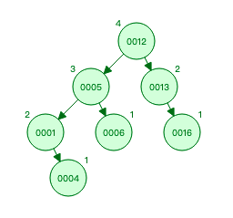
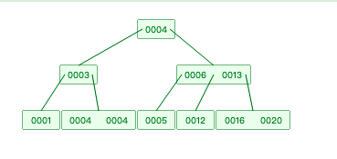

### 平衡二叉树

https://www.cs.usfca.edu/~galles/visualization/AVLtree.html

它是一棵空树或它的左右两个子树的高度差的绝对值不超过1，并且左右两个子树都是一棵平衡二叉树。

插入，查找，删除的时间复杂度最好情况和最坏情况都维持在O(logN)

### B-tree

##### 与二叉搜索树的不同

- 平衡二叉树节点最多有两个子树，而一棵m阶b树最多可以有m棵子树。
- 平衡二叉树的一个节点只有一个关键字，而一棵m阶b树最多可以有m-1个关键字，最少有m/2个关键字。
- B 树的所有叶子节点都在同一层，并且叶子节点只有关键字，指向孩子的指针为 null

B 树的节点数据大小也是按照左小右大，子树与节点的大小比较决定了子树指针所处位置。

一棵b树必须满足以下条件：

1. 若根结点不是终端结点，则至少有2棵子树
2. 除根节点以外的所有非叶结点至少有 M/2 棵子树，至多有 M 个子树（关键字数为子树减一）
3. 所有的叶子结点都位于同一层

**B 树的每个节点可以表示的信息更多，因此整个树更加“矮胖”，这在从磁盘中查找数据（先读取到内存、后查找）的过程中，可以减少磁盘 IO 的次数，从而提升查找速度。**

### B+tree

##### 与B树的不同

- 一棵m阶b+树最多可以有m棵子树。
- 一棵m阶b树最多可以有**m**个关键字，最少有m/2个关键字。
- B+树的所有叶子节点都在同一层，并且**只有叶子节点**存储了实际数据，指向孩子的指针为 null

非叶子结点的子树指针P[i]，指向关键字值属于[K[i], K[i+1])的子树

B+树的非叶子节点只是存储key，占用空间非常小，因此每一层的节点能索引到的数据范围更加的广。

支持范围查询。

##### B+树插入

插入操作全部在叶子节点中进行

1.若为空树，创建一个叶子节点，然后将记录插入，同时这个叶子节点也是根节点；

2.若被插入的关键字所在的节点，其含有的关键字数目小于m，则直接插入；

3.若被插入关键字所在的节点的关键字数等于m的时候，则需要分裂为两个节点，并将m/2的关键字上移到父节点中，同时判断父节点的关键字个数是否大于m，如果需要分裂继续按照上面的流程进行分裂。

##### B+树删除

1.如果要删除关键字所在节点的关键字个数，如果大于m/2，直接删除即可；

2.当删除关键字所在节点的关键字个数等于m/2的时候，若兄弟节点中含有多余的关键字，也可从兄弟节点中借用关键字完成删除操作；

3.若兄弟节点没有多余的关键字，则需要与其他兄弟进行合并；

4.如果合并后导致父节点不再符合B+树的结构，则需要按照上面的规律进行再次结构的调整；

5.注意B+树的结构（非叶子节点会存储索引信息，叶子节点才会存储数据指针），修改完后还需修改其父节点中的索引值。

https://juejin.cn/post/6910880043980259342