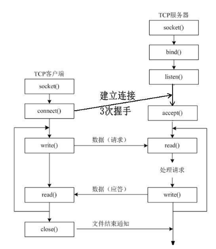
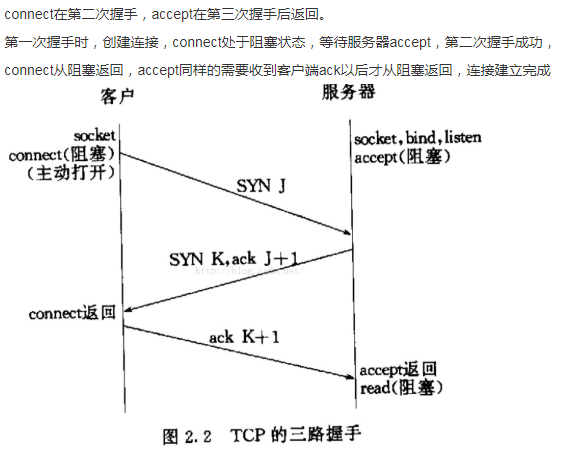

socket分为两种，一种套接字正如accept的参数sockfd，它是listen socket，在调用listen函数之后，一个socket会从主动连接的套接字变为listen 套接字；而accept返回是一个连接套接字，它代表着一个网络已经存在的点对点连接。以后的数据交互就是基于这个连接socket ,而之前的那个listen socket可以继续工作，从而接收更多的连接。

Accept默认会阻塞进程，直到有一个客户连接建立后返回。

