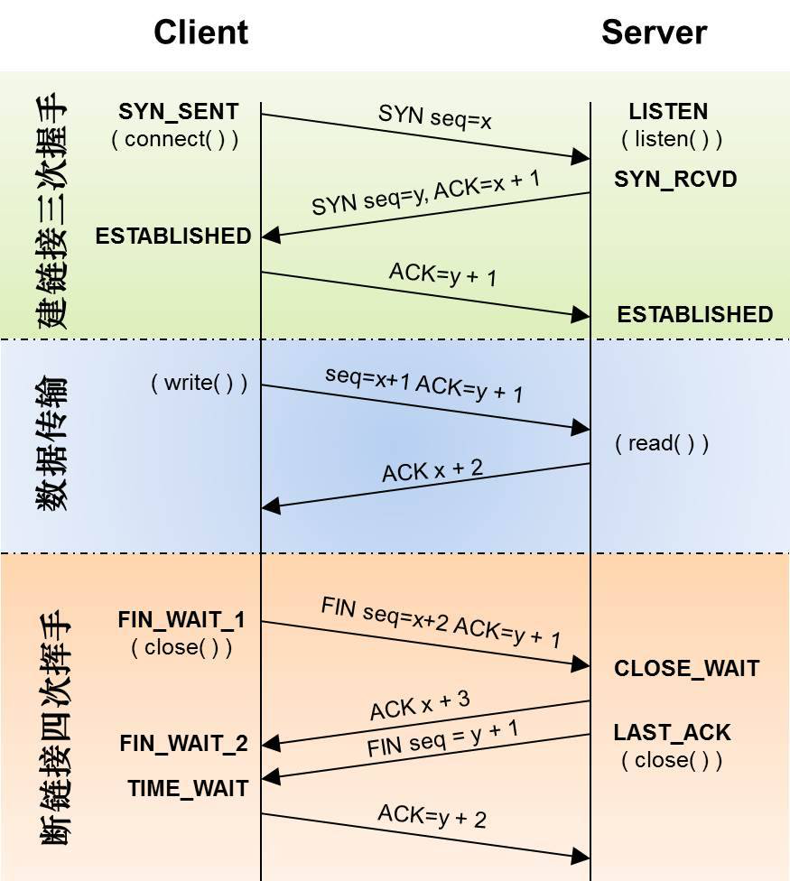
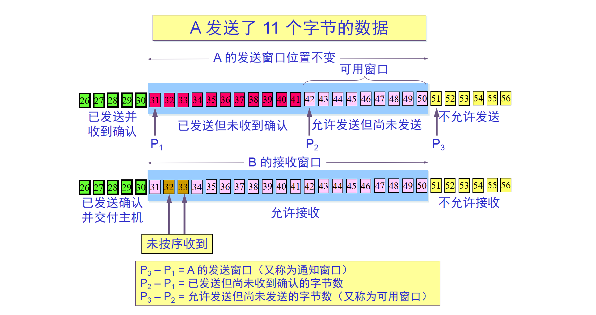

# 计算机网络

### OSI七层模型与TCP/IP四层模型

##### 数据在各层之间的传递过程

简单来说向下的过程不断添加首部和尾部，向上的过程不断拆开首部和尾部。

路由器是网络层设备，交换机是数据链路层设备。

### TCP和UDP的特点

**用户数据包协议UDP** 是无连接的，尽最大可能交付，没有拥塞控制，面向报文（对应用程序传下来的报文不合并也不拆分，只添加UDP首部）支持一对一、一对多、多对多的交互通信。

**传输控制协议TCP** 是面向连接的，提供可靠交付，有流量控制、拥塞控制，提供全双工通信，面向字节流（对应用层的数据组织成大小不等的数据块），每一条TCP连接只能是点对点。

### HTTP1.0和HTTP1.1的区别

HTTP1.1在1999年开始广泛应用

**1.缓存处理**

**2.带宽优化及网络连接的使用** HTTP1.1在请求头中引入了range头域，它允许只请求资源的某一个部分，支持断点续传。

**3.错误通知的处理** 新增24个错误状态响应码，如409表示请求的资源与资源的当前状态发生冲突；410表示该资源在服务器中被永久性删除。

**4.Host头处理** 在HTTP1.0的时代认为每个服务器都绑定唯一一个IP地址，因此请求头中没有传递主机名。而随着虚拟主机技术的发展，每一台服务器上可以存在多个虚拟主机，共享一个IP地址。HTTP1.1的请求消息和响应消息都应该支持Host头域，且请求消息如果没有Host头域会报一个错误400。

**5.长连接** HTTP1.1支持长连接和请求的流水线处理，在一个TCP连接上可以传递多个HTTP请求和响应，减少了建立和关闭连接的消耗和延迟。在HTTP1.1默认开启Connection：keep-alive，一定程度上弥补了HTTP1.0每次请求都要创建连接的缺点。

### TCP的三次握手和四次挥手

##### 为什么不是两次握手？

> 为了防止已经失效的连接请求报文突然又传送到了服务端，因而产生错误

假定一种情况，client端的一个连接请求报文并没有丢失，而是在网络中滞留，client没有收到这个报文的回复，认为连接失效，就发送了其他连接请求，而server收到这个请求后，发出请求确认，在没有对这个请求确认报文的确认的前提下，client对这个请求确认报文不予理睬，server端自己建立了一个没有client的连接，白白浪费了资源。而如果有对确认报文的确认，client不会发送这个确认，server也就不会建立这个连接。

##### 为什么连接建立是三次，而挥手是四次？

在请求建立时server对与SYN和ACK是一起发送的，而在结束连接时，SYN和ACK是分开发送的，这是由于在收到client的连接释放请求后，server也许还有数据没有发送，故先确认了client的连接释放，而自己此时还可以发送数据，发送结束后确认了自己的连接释放。

##### 为什么client在四次挥手时会有2MSL的延时？

MSL：最大报文生存时间。

假定网络不可靠，client第四次发送的ACK可能丢失，在2MSL后是接收到server的重新发送确认的时间节点，如果到这个节点时还没有接到新的连接释放请求，说明请求没有丢失。

### TCP流量控制

我们希望数据在双方都能承受的情况下，尽可能发送的快一些。

所谓流量控制，就是让发送方不要发送的太快，要让接收方来得及接收。

TCP利用滑动窗口机制实现对发送方的流量控制，发送方的发送窗口大小不可大于接收方给出的最大窗口。

**TCP的窗口单位是字节，不是报文段。**

对ACK的认识。ACK包含了两个非常重要的信息：

​	1、期望收到的下一字节的序号n，该n代表接收方已经收到了前n-1字节的数据，如果发送方未按需求发送了非第n+1字节数据，接收方不会对这些数据进行确认，而仍旧发送确认号为n的ACK。

​	2、当前窗口大小m，发送方可以根据这两个数据计算出还有多少个字节可以发送。假定当前已经发送x字节，则可以发送的字节数y=m-(x-n)。

### TCP拥塞控制

拥塞控制就是防止过多的数据注入网络，避免网络中的路由器或链路过载。

拥塞控制是一个全局的过程，和流量控制不同，流量控制指点对点流量的控制。

进行拥塞控制的四种算法：

- 慢开始
- 拥塞避免
- 快重传
- 快恢复

发送方维持一个拥塞窗口cwnd，大小取决于网络的拥塞程度。发送窗口可能小于拥塞窗口。

慢开始：不要一开始就发送大量数据，由小到大逐渐增加拥塞窗口大小。每经过一个传输轮次后拥塞窗口就加倍。

拥塞避免：与慢开始不同，拥塞窗口加一。

快重传：要求接收方在收到一个失效的报文段后立即发出重复确认，而不是在自己发送数据时捎带确认。使发送方能今早重传未被确认的报文段。

快恢复：在收到多个重复确认时不执行慢开始算法，只将ssthresh减半。如果未收到多个，将cwnd设置为ssthresh，执行拥塞避免。

### TCP实现可靠传输的机制

TCP并不能保证数据一定被对方接到。

- 校验和
- 定时器（超时重传）
- 序号
- 确认
- 否定确认
- 窗口和流水线

### TCP和UDP对应的应用层协议

TCP：

- FTP 文件传输协议，端口21
- Telnet 一种远程登录的端口，端口23
- SMTP 邮件传送协议，用于发送邮件。端口25
- POP3 用于接收邮件，端口110
- HTTP 超文本传输协议

UDP

- DNS 域名解析服务，端口53

- SNTP 简单网络管理协议，端口161

- TFTP 简单文件传输协议，端口69

### 网络层协议

ICMP 网际控制报文协议，专门用于发送差错报文的协议，由于IP协议是一种尽力传送的通信协议，传送的数据可能丢失、重复、延迟、乱序，所以需要一种尽量避免差错并在差错发生时发送报告的机制。

IGMP 网际组管理协议，允许Internet中计算机参加组播，是计算机用作向相邻路由器报告多目成员的协议。

ARP 地址解析协议，动态完成IP地址向物理地址的转换。

RARP 反向地址解析协议。

IP协议 为了计算机网络之间互联的协议。

### SYN洪水攻击

相当于TCP建立建立连接二次握手。攻击者伪造大量不存在ip，向服务器发送SYN包，服务器发送确认后等待确认，不断超时重发，造成大量未连接队列，导致系统缓慢，引起网路堵塞。

### Session和Cookie