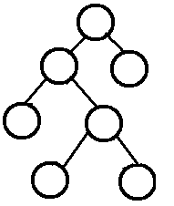

##### Spring如何解决循环依赖问题

首先循环依赖是一种正常的情况，只是因为Spring容器对**构造函数**配置Bean进行实例化有一个前提，**被注入的对象必须处于已准备好的状态**，而循环依赖时被注入的对象中还有未注入的属性，**所以解决方法就是将其中一个Bean采用setter方式注入**

##### redis缓存同步问题

因为写和读是并发的，没法保证顺序，如果删了缓存，还没有来得及写库，另一个线程就来读取，发现缓存为空，则去数据库中读取数据写入缓存，此时缓存中为脏数据。如果先写了库，再删除缓存前，写库的线程宕机了，没有删除掉缓存，则也会出现数据不一致情况。 如果是redis集群，或者主从模式，写主读从，由于redis复制存在一定的时间延迟，也有可能导致数据不一致。

解决方法是双删加超时，在写数据库前后都操作缓存，最差情况在超时时间内数据不一致。

##### 缓存击穿

缓存击穿表示恶意用户模拟请求很多缓存中不存在的数据，由于缓存中都没有，导致这些请求短时间内直接落在了数据库上，导致数据库异常。（最好读写分离）

解决方法：

使用互斥锁排队，根据key获取value的值为空时，将数据库操作加锁。

接口限流

使用布隆过滤器（可以快速返回key值是否存在）

##### 缓存穿透

缓存在同一时间内大量失效，造成短时数据库压力过大。

加锁排队

缓存超时时间+随机时间，避免同时过期

建立备份缓存，不同的超时时间

##### 缓存雪崩

redis服务器挂掉造成数据库压力过大

##### 代理模式与装饰器模式的区别

代理模式和装饰器模式都要求实现同一接口，都很容易的在原始对象前后加自定义方法。

装饰器模式关注于在对象上动态的添加方法，然而代理模式关注于控制对对象的访问。当使用代理模式的时候通常在代理类中创建一个对象实例，当使用装饰器模式时，通常的做法是将原始对象作为一个参数传递给代理对象。

使用代理模式，代理对象与原始对象的关系在编译时就已经确定了；而装饰者能够在运行时递归地被构造。

##### 静态内部类的实例化方法

```java

public class Main {
	public static void main(String[] args) throws IOException {
		
		Main m = new Main();
		C1 c = new C1();
		System.out.println(c.a);
//		C1 c2 = new Main().new C1();
		C1 c3 = new Main.C1();
		System.out.println(c3.a);
		
//		C2 c4 = new C2();
		C2 c5 = new Main().new C2();
		System.out.println(c5.a);
	}
	
	static class C1{
		int a = 1;
	}
	class C2{
		int a = 1;
	}
}
```

##### RPC框架

远程过程调用，是分布式系统的一种常用的通信方法，它允许程序调用另一个地址空间（通常是共享网络的另一台机器上）的过程或函数，而不是程序员显式编码这个远程调用的细节。

除RPC之外，常见的多系统数据交互方案还有分布式消息队列、HTTP请求调用、数据库和分布式缓存等。

其中RPC和HTTP都是没有经过中间件的，它是端到端系统的直接交互。

**RPC需要解决的三个问题：**

- 服务端如何确定客户端调用的函数？

  在远程调用中，客户端和服务端分别维护了一个"id->函数""的对应表，ID在所有进程中都是唯一确定的。客户端在做远程调用时附上这个ID，服务端通过查表，来确定客户端调用的指定函数，然后执行响应的代码。

- 如何进行序列化和反序列化？

  客户端与服务端交互时将参数或结果转化为字节流在网络中传输，那么数据在转化成字节流时需要序列化和反序列化，其速度也会影响远程调用的效率。

- 如何进行远程传输（选择何种网络协议）？

  多数RPC框架选择TCP作为传输协议，也有部分选择HTTP。TCP更加高效，而HTTP更加灵活。

##### 二叉树

完全二叉树

除最后一层之外每一层都被完全填充，并且所有节点都保持左对齐。


满二叉树

除了叶子结点之外的每一个结点都有两个孩子，每一层(当然包含最后一层)都被完全填充。

完满二叉树

除叶子节点之外的每一个节点都有两个孩子。



##### 哈希冲突的解决方法

- 开放定址法

  当产生哈希冲突时，在该地址的基础上再进行一次哈希操作，直到得到的结果地址不产生冲突。

  线性探测再散列：产生冲突后，查看下个位置是否为空，找到空的地方存放

  二次探测再散列：在表的左右进行跳跃式探测，比较灵活

  伪随机数探测再散列：指定伪随机数数列，根据这个数列进行响应计算探测

- 再哈希法

  同时构造多个不同的哈希函数，哈希冲突时换用另一个哈希函数，直到不产生冲突。

- 拉链法

