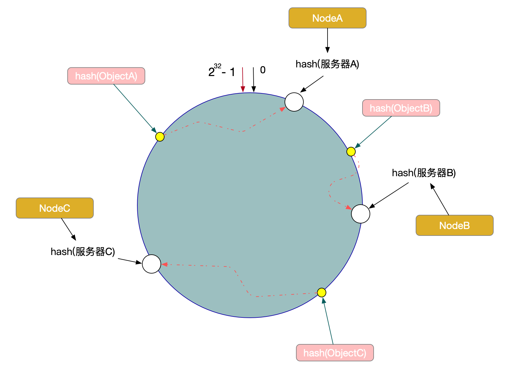

# 一致性hash算法

##### 普通hash算法问题

比如存在一个hash()，对于十条数据与三台节点，使用取模方式定位对应节点：hash(object)%3。

当扩容到五台节点时，hash(object)%5的结果几乎所有数据对应的节点都变化了。

这对于扩容与缩容操作是复杂的。

##### 一致性hash算法原理

上述取模方法是对节点数量进行取模，而节点数量是变化的才导致对应节点变化。

一致性hash算法是对固定值2^32取模，对节点的标识（如ip，sn）取模，同时定位数据与节点的位置，通过位置来确定映射关系。

将数据Key使用相同的函数Hash计算出哈希值，并确定此数据在环上的位置，从此位置沿环顺时针查找，遇到的服务器就是其应该定位到的服务器。

根据一致性算法，Object -> NodeA，ObjectB -> NodeB, ObjectC -> NodeC。

如果节点B宕机，那么受影响的数据只有节点A到节点B之间的数据（原B上的数据），顺延到节点C上。同样如果是扩容2倍的话，将一些区间分割成子区间上，落在相应的节点。

##### 问题

问题很明显，数据倾斜问题

如果对节点的hash方法不合适，很容易造成区间分配不均，所承载的节点相应的也会不均匀。

另外比如上面一个节点宕机，那么原来在这个节点上的数据都会落在同一个（下一个）节点上，更极端的情况，如果一系列ip：.1 .2 .3 .4 .5 .6，由于网络原因.2～.5的节点都宕机了，那么原来四个节点的数据都会落在.6上，很容易造成内存溢出。

为了避免出现数据倾斜问题，一致性 Hash 算法引入了虚拟节点的机制，也就是每个机器节点会进行多次哈希，最终**每个机器节点在哈希环上都会有多个虚拟节点存在**，使用这种方式来大大削弱甚至避免数据倾斜问题。同时数据定位算法不变，只是多了一步虚拟节点到实际节点的映射，例如定位到“D1#1”、“D1#2”、“D1#3”三个虚拟节点的数据均定位到 D1 上。这样就解决了服务节点少时数据倾斜的问题。在实际应用中，通常将虚拟节点数设置为32甚至更大，因此即使很少的服务节点也能做到相对均匀的数据分布。这也是 Dubbo 负载均衡中有一种一致性哈希负载均衡的实现思想。

https://www.jianshu.com/p/528ce5cd7e8f